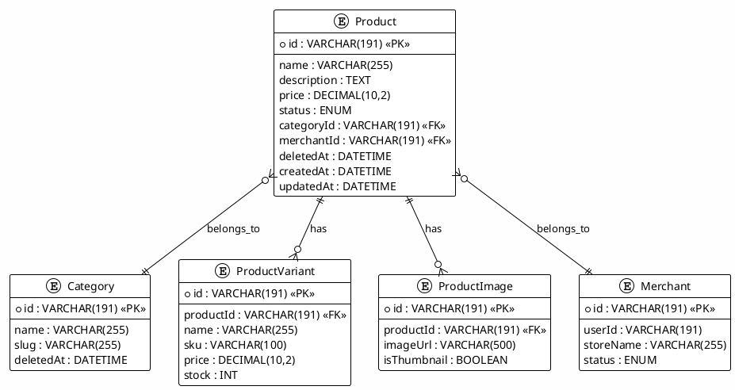

# 02_PRODUCTS_MODULE - Hướng Dẫn Kiểm Thử Chi Tiết

**Kiểm Thử Module Quản Lý Sản Phẩm (Product Management)**

**Phạm Vi:** UC1.22-UC1.34  
**Phiên Bản:** 1.0  
**Cập Nhật:** 7/12/2025

---

## 📋 MỤC LỤC

1. [Tổng Quan Module](#1-tổng-quan-module)
2. [Phân Tích Yêu Cầu](#2-phân-tích-yêu-cầu)
3. [Chiến Lược Kiểm Thử](#3-chiến-lược-kiểm-thử)
4. [Sơ Đồ Kiến Trúc](#4-sơ-đồ-kiến-trúc)
5. [Test Cases Chi Tiết](#5-test-cases-chi-tiết)
6. [Ví Dụ Mã](#6-ví-dụ-mã)
7. [Hướng Dẫn Thực Thi](#7-hướng-dẫn-thực-thi)

---

## 1. TỔNG QUAN MODULE

### Mục Đích

Module Products cung cấp các chức năng CRUD (Create, Read, Update, Delete) sản phẩm, bao gồm:

- **Lấy danh sách** sản phẩm với phân trang
- **Tìm kiếm & Lọc** sản phẩm theo tiêu chí
- **Sắp xếp** sản phẩm theo giá, ngày tạo
- **Tạo/Cập nhật/Xóa** sản phẩm
- **Quản lý giá & stock** của sản phẩm

### Các Thành Phần Chính

```
ProductController (API endpoints)
    ↓
ProductService (Business logic)
    ↓
Database (Prisma ORM)
    ↓
Product Model + Category + Merchant relations
```

### Stack Công Nghệ

- **Framework:** Express.js (Node.js)
- **ORM:** Prisma
- **Database:** MySQL 8.0
- **Validation:** Joi / Custom validators
- **Testing:** Jest + Supertest

---

## 2. PHÂN TÍCH YÊU CẦU

### 2.1 Chức Năng Chính (Functional Requirements)

| ID  | Chức Năng              | Chi Tiết                            |
| --- | ---------------------- | ----------------------------------- |
| F1  | Lấy danh sách sản phẩm | Phân trang, lọc soft-deleted        |
| F2  | Lấy chi tiết sản phẩm  | Bao gồm variants, images, merchant  |
| F3  | Tạo sản phẩm mới       | Chỉ Admin/Merchant, validate input  |
| F4  | Cập nhật sản phẩm      | Chỉ owner/admin, update thành công  |
| F5  | Xóa sản phẩm           | Soft delete (set deletedAt)         |
| F6  | Tìm kiếm theo tên      | Partial match, case-insensitive     |
| F7  | Lọc theo category      | Only products in specified category |
| F8  | Lọc theo khoảng giá    | minPrice ≤ price ≤ maxPrice         |
| F9  | Sắp xếp sản phẩm       | By price ASC/DESC, by createdAt     |
| F10 | Quản lý variants       | List, update stock per variant      |

### 2.2 Yêu Cầu Phi Chức Năng (Non-Functional)

| ID  | Yêu Cầu        | Tiêu Chí                                    |
| --- | -------------- | ------------------------------------------- |
| NF1 | Hiệu suất      | Lấy 100 sản phẩm < 200ms                    |
| NF2 | Bảo mật        | Authorization checks cho edit/delete        |
| NF3 | Validation     | Kiểm tra input (price, name length)         |
| NF4 | Data Integrity | Đảm bảo consistency giữa product + variants |
| NF5 | Concurrency    | Handle multiple updates đúng                |

### 2.3 Điều Kiện Bắt Đầu (Entry Criteria)

- ✅ Database schema created (products, product_variants, categories, merchants)
- ✅ ProductController endpoints implemented
- ✅ Prisma migrations applied
- ✅ Test environment setup

### 2.4 Tiêu Chí Kết Thúc (Exit Criteria)

- ✅ Tất cả 13 test cases Pass (UC1.22-UC1.34)
- ✅ Code coverage ≥ 85%
- ✅ Không có critical bugs
- ✅ Performance meets requirements

---

## 3. CHIẾN LƯỢC KIỂM THỬ

### 3.1 Phân Cấp Kiểm Thử

```
Unit Tests (70%)
├── ProductController (API layer)
├── ProductService (Business logic)
└── Validation rules

Integration Tests (30%)
├── Database operations
├── Category relationships
└── Multi-step workflows
```

### 3.2 Kỹ Thuật Kiểm Thử Áp Dụng

#### Equivalence Partitioning

```
Price validation:
- Valid: 10,000, 50,000, 1,000,000
- Invalid: 0, -1, null, "abc"

Product name:
- Valid: "Laptop Dell XPS", "iPhone 15"
- Invalid: "", null, 251+ characters
```

#### Boundary Value Analysis

```
Pagination:
- page: 1 (min), 2 (normal), 9999 (max)
- limit: 1 (min), 20 (normal), 100 (max)

Price filter:
- minPrice: 0 (min), 500,000
- maxPrice: 1,000,000, 10,000,000 (max)
```

#### State Transition Testing

```
Product lifecycle:
DRAFT → ACTIVE → INACTIVE → (DELETED via soft delete)
```

---

## 4. SƠ ĐỒ KIẾN TRÚC

### 4.1 Entity Relationship Diagram



### 4.2 API Request/Response Flow

```
GET /api/products?page=1&limit=20&search=laptop&minPrice=10000&maxPrice=500000&sort=price&order=asc
    ↓
ProductController.getProducts()
    ↓
ProductService.findAll(filters)
    ↓
Database Query (Prisma)
    ↓
Response: {
  data: [...],
  pagination: { page, limit, total, pages },
  meta: { timestamp, endpoint }
}
```

---

## 5. TEST CASES CHI TIẾT

### 5.1 CRUD Operations (UC1.22-UC1.26)

#### **UC1.22: Lấy Danh Sách Sản Phẩm (Pagination)**

| Thuộc Tính            | Giá Trị                                       |
| --------------------- | --------------------------------------------- |
| **Mô Tả**             | Lấy danh sách sản phẩm với phân trang         |
| **Điều Kiện Tiền Đề** | Database có ≥20 sản phẩm                      |
| **Bước Thực Thi**     | 1. GET /api/products?page=1&limit=20          |
| **Kết Quả Mong Đợi**  | HTTP 200, mảng sản phẩm 20 items, total count |
| **Dữ Liệu Kiểm Thử**  | page=1, limit=20                              |
| **Loại Test**         | Unit + Integration                            |

**Test Cases Con:**

```javascript
// Page 1 with default limit
GET /api/products?page=1
→ Status 200, data.length ≤ 10 (default limit)

// Custom limit
GET /api/products?page=1&limit=50
→ Status 200, data.length ≤ 50

// Page beyond available
GET /api/products?page=999
→ Status 200, data.length = 0 (empty array)
```

#### **UC1.23: Lấy Chi Tiết Sản Phẩm**

| Thuộc Tính            | Giá Trị                                                         |
| --------------------- | --------------------------------------------------------------- |
| **Mô Tả**             | Lấy chi tiết sản phẩm với tất cả thông tin liên quan            |
| **Điều Kiện Tiền Đề** | Product với ID tồn tại, có variants & images                    |
| **Bước Thực Thi**     | 1. GET /api/products/{productId}                                |
| **Kết Quả Mong Đợi**  | HTTP 200, product object with nested variants, images, merchant |
| **Dữ Liệu Kiểm Thử**  | productId: "prod-123"                                           |
| **Loại Test**         | Unit                                                            |

**Test Cases Con:**

```javascript
// Valid product
GET /api/products/prod-123
→ Status 200, has: id, name, price, category, merchant, variants[], images[]

// Non-existent product
GET /api/products/invalid-id
→ Status 404, { error: "Product not found" }

// Deleted product (soft delete)
GET /api/products/deleted-prod-id
→ Status 404 (should exclude deletedAt products)
```

#### **UC1.24: Tạo Sản Phẩm Mới**

| Thuộc Tính            | Giá Trị                                        |
| --------------------- | ---------------------------------------------- |
| **Mô Tả**             | Tạo sản phẩm mới (chỉ Admin/Merchant)          |
| **Điều Kiện Tiền Đề** | User có role Admin hoặc Merchant, token hợp lệ |
| **Bước Thực Thi**     | 1. POST /api/products với data                 |
| **Kết Quả Mong Đợi**  | HTTP 201, product created with ID              |
| **Dữ Liệu Kiểm Thử**  | { name, description, price, categoryId }       |
| **Loại Test**         | Unit + Integration                             |

**Test Cases Con:**

```javascript
// Valid request - Merchant
POST /api/products
Headers: Authorization: Bearer token
Body: { name: "Laptop", price: 15000000, categoryId: "cat-1" }
→ Status 201, product.id exists, product.merchantId = current user

// Missing required field
POST /api/products
Body: { name: "Laptop", categoryId: "cat-1" } // missing price
→ Status 400, { error: "price is required" }

// Non-authenticated user
POST /api/products
Headers: (no Authorization)
→ Status 401, { error: "Unauthorized" }

// Insufficient permission
POST /api/products (as customer user)
→ Status 403, { error: "Only Admin/Merchant can create products" }
```

#### **UC1.25: Cập Nhật Sản Phẩm**

| Thuộc Tính            | Giá Trị                               |
| --------------------- | ------------------------------------- |
| **Mô Tả**             | Cập nhật thông tin sản phẩm           |
| **Điều Kiện Tiền Đề** | Product tồn tại, user là owner/admin  |
| **Bước Thực Thi**     | 1. PUT /api/products/{id} với data    |
| **Kết Quả Mong Đợi**  | HTTP 200, product updated             |
| **Dữ Liệu Kiểm Thử**  | { name: "New Name", price: 20000000 } |
| **Loại Test**         | Unit                                  |

**Test Cases Con:**

```javascript
// Update by owner
PUT /api/products/prod-123
Body: { name: "Updated Name", price: 20000000 }
→ Status 200, product.name = "Updated Name", product.price = 20000000

// Update by non-owner
PUT /api/products/prod-123 (user is different merchant)
→ Status 403, { error: "Cannot update other merchant's products" }

// Invalid price
PUT /api/products/prod-123
Body: { price: -1000 }
→ Status 400, { error: "Price must be positive" }
```

#### **UC1.26: Xóa Sản Phẩm (Soft Delete)**

| Thuộc Tính            | Giá Trị                                    |
| --------------------- | ------------------------------------------ |
| **Mô Tả**             | Xóa sản phẩm (soft delete - set deletedAt) |
| **Điều Kiện Tiền Đề** | Product tồn tại, user là owner/admin       |
| **Bước Thực Thi**     | 1. DELETE /api/products/{id}               |
| **Kết Quả Mong Đợi**  | HTTP 200, product.deletedAt is set         |
| **Dữ Liệu Kiểm Thử**  | productId: "prod-123"                      |
| **Loại Test**         | Unit                                       |

**Test Cases Con:**

```javascript
// Soft delete
DELETE /api/products/prod-123
→ Status 200, product.deletedAt != null

// Try to delete already deleted
DELETE /api/products/already-deleted-prod
→ Status 404, { error: "Product not found" }

// Try to delete non-owned product
DELETE /api/products/prod-123 (different merchant)
→ Status 403
```

### 5.2 Search & Filter (UC1.28-UC1.31)

#### **UC1.28: Tìm Kiếm Theo Tên**

```javascript
// Test case 1: Exact match
GET /api/products?search=laptop
// Expected: products with "laptop" in name (case-insensitive)

// Test case 2: Partial match
GET /api/products?search=lap
// Expected: products like "%lap%"

// Test case 3: Special characters
GET /api/products?search=laptop+pro
// Expected: handle URL encoding

// Test case 4: No match
GET /api/products?search=xyz123notexist
// Expected: empty array
```

#### **UC1.29: Lọc Theo Category**

```javascript
// Test case 1: Valid category
GET /api/products?categoryId=cat-electronics
// Expected: only products in electronics category

// Test case 2: Category with subcategories
GET /api/products?categoryId=cat-phones&includeSubcategories=true
// Expected: products in phones + all subcategories

// Test case 3: Invalid category
GET /api/products?categoryId=invalid-cat
// Expected: empty array (or 400 error)
```

#### **UC1.30: Lọc Theo Khoảng Giá**

```javascript
// Test case 1: Min and max price
GET /api/products?minPrice=10000000&maxPrice=50000000
// Expected: 10,000,000 ≤ price ≤ 50,000,000

// Test case 2: Only min price
GET /api/products?minPrice=10000000
// Expected: price ≥ 10,000,000

// Test case 3: Only max price
GET /api/products?maxPrice=50000000
// Expected: price ≤ 50,000,000

// Test case 4: Invalid price range
GET /api/products?minPrice=50000000&maxPrice=10000000
// Expected: empty array or swap values
```

#### **UC1.31: Sắp Xếp Sản Phẩm**

```javascript
// Test case 1: Sort by price ascending
GET /api/products?sortBy=price&order=asc
// Expected: prices in ascending order

// Test case 2: Sort by price descending
GET /api/products?sortBy=price&order=desc
// Expected: prices in descending order

// Test case 3: Sort by creation date
GET /api/products?sortBy=createdAt&order=desc
// Expected: newest products first

// Test case 4: Default sort
GET /api/products
// Expected: sorted by createdAt DESC (or default defined in code)
```

### 5.3 Variants & Stock (UC1.32-UC1.34)

#### **UC1.32: Lấy Danh Sách Variants**

```javascript
describe("Get Product Variants", () => {
  test("Should return all variants with stock info", async () => {
    const res = await request(app).get(`/api/products/prod-123/variants`);

    expect(res.status).toBe(200);
    expect(Array.isArray(res.body)).toBe(true);
    expect(res.body[0]).toHaveProperty("id");
    expect(res.body[0]).toHaveProperty("name");
    expect(res.body[0]).toHaveProperty("stock");
  });

  test("Should return 404 for non-existent product", async () => {
    const res = await request(app).get(`/api/products/invalid/variants`);

    expect(res.status).toBe(404);
  });
});
```

#### **UC1.33: Cập Nhật Stock**

```javascript
describe("Update Variant Stock", () => {
  test("Should update stock successfully", async () => {
    const res = await request(app)
      .patch(`/api/products/prod-123/variants/var-1/stock`)
      .send({ stock: 50 })
      .set("Authorization", `Bearer ${merchantToken}`);

    expect(res.status).toBe(200);
    expect(res.body.stock).toBe(50);
  });

  test("Should not update negative stock", async () => {
    const res = await request(app)
      .patch(`/api/products/prod-123/variants/var-1/stock`)
      .send({ stock: -10 })
      .set("Authorization", `Bearer ${merchantToken}`);

    expect(res.status).toBe(400);
  });
});
```

#### **UC1.34: Prevent Order When Out of Stock**

```javascript
describe("Prevent Out of Stock Orders", () => {
  test("Should reject order if quantity > available stock", async () => {
    // Setup: variant has 5 items in stock
    await setupVariantStock("var-1", 5);

    const res = await request(app)
      .post(`/api/cart`)
      .send({ productVariantId: "var-1", quantity: 10 })
      .set("Authorization", `Bearer ${customerToken}`);

    expect(res.status).toBe(400);
    expect(res.body.error).toContain("stock");
  });

  test("Should accept order if quantity = stock", async () => {
    await setupVariantStock("var-1", 10);

    const res = await request(app)
      .post(`/api/cart`)
      .send({ productVariantId: "var-1", quantity: 10 })
      .set("Authorization", `Bearer ${customerToken}`);

    expect(res.status).toBe(201);
  });
});
```

---

## 6. VÍ DỤ MÃ

### 6.1 Controller Implementation (Reference)

```javascript
// backend/controllers/productController.js

class ProductController {
  async getProducts(req, res) {
    try {
      const {
        page = 1,
        limit = 10,
        search,
        categoryId,
        minPrice,
        maxPrice,
        sortBy = "createdAt",
        order = "desc",
      } = req.query;

      // Validation
      if (isNaN(page) || page < 1)
        return res.status(400).json({ error: "Invalid page" });
      if (isNaN(limit) || limit < 1)
        return res.status(400).json({ error: "Invalid limit" });

      // Build filter
      const where = { deletedAt: null };
      if (search) where.name = { contains: search, mode: "insensitive" };
      if (categoryId) where.categoryId = categoryId;
      if (minPrice) where.price = { gte: parseFloat(minPrice) };
      if (maxPrice) where.price = { ...where.price, lte: parseFloat(maxPrice) };

      // Query
      const products = await prisma.product.findMany({
        where,
        skip: (page - 1) * limit,
        take: parseInt(limit),
        orderBy: { [sortBy]: order },
        include: { category: true, merchant: true },
      });

      const total = await prisma.product.count({ where });

      return res.status(200).json({
        data: products,
        pagination: {
          page: parseInt(page),
          limit: parseInt(limit),
          total,
          pages: Math.ceil(total / limit),
        },
      });
    } catch (error) {
      return res.status(500).json({ error: error.message });
    }
  }

  async getProductById(req, res) {
    try {
      const { id } = req.params;

      const product = await prisma.product.findUnique({
        where: { id },
        include: {
          variants: true,
          images: true,
          category: true,
          merchant: true,
        },
      });

      if (!product || product.deletedAt) {
        return res.status(404).json({ error: "Product not found" });
      }

      return res.status(200).json(product);
    } catch (error) {
      return res.status(500).json({ error: error.message });
    }
  }

  async createProduct(req, res) {
    try {
      const { name, description, price, categoryId, images } = req.body;
      const userId = req.user.id;

      // Validation
      if (!name) return res.status(400).json({ error: "name is required" });
      if (!price) return res.status(400).json({ error: "price is required" });
      if (price < 0)
        return res.status(400).json({ error: "price must be positive" });
      if (!categoryId)
        return res.status(400).json({ error: "categoryId is required" });

      // Check permission
      if (req.user.role !== "admin") {
        const merchant = await prisma.merchant.findUnique({
          where: { userId },
        });
        if (!merchant)
          return res
            .status(403)
            .json({ error: "Only merchants can create products" });
      }

      // Create product
      const product = await prisma.product.create({
        data: {
          name,
          description,
          price: parseFloat(price),
          categoryId,
          merchantId:
            req.user.role === "admin" ? req.body.merchantId : merchant.id,
          images: images ? { createMany: { data: images } } : undefined,
        },
        include: { images: true, category: true, merchant: true },
      });

      return res.status(201).json(product);
    } catch (error) {
      return res.status(500).json({ error: error.message });
    }
  }
}

module.exports = new ProductController();
```

### 6.2 Test File (Jest Example)

```javascript
// backend/tests/unit/product.test.js

const request = require("supertest");
const app = require("../../app");
const { prisma } = require("../../lib/prisma");

describe("Product Controller", () => {
  let productId, merchantToken, adminToken;

  beforeAll(async () => {
    // Setup test data
    merchantToken = generateToken({ id: "user-1", role: "merchant" });
    adminToken = generateToken({ id: "user-2", role: "admin" });
  });

  afterAll(async () => {
    await prisma.$disconnect();
  });

  describe("GET /api/products", () => {
    test("UC1.22: Should return paginated products", async () => {
      const res = await request(app).get("/api/products?page=1&limit=10");

      expect(res.status).toBe(200);
      expect(res.body).toHaveProperty("data");
      expect(res.body).toHaveProperty("pagination");
      expect(res.body.pagination.page).toBe(1);
    });

    test("Should handle invalid page", async () => {
      const res = await request(app).get("/api/products?page=invalid");

      expect(res.status).toBe(400);
    });

    test("UC1.28: Should search by name", async () => {
      const res = await request(app).get("/api/products?search=laptop");

      expect(res.status).toBe(200);
      res.body.data.forEach((product) => {
        expect(product.name.toLowerCase()).toContain("laptop");
      });
    });

    test("UC1.30: Should filter by price range", async () => {
      const res = await request(app).get(
        "/api/products?minPrice=10000000&maxPrice=50000000"
      );

      expect(res.status).toBe(200);
      res.body.data.forEach((product) => {
        expect(product.price).toBeGreaterThanOrEqual(10000000);
        expect(product.price).toBeLessThanOrEqual(50000000);
      });
    });
  });

  describe("POST /api/products", () => {
    test("UC1.24: Should create product with valid data", async () => {
      const res = await request(app)
        .post("/api/products")
        .set("Authorization", `Bearer ${merchantToken}`)
        .send({
          name: "Test Laptop",
          description: "High performance laptop",
          price: 15000000,
          categoryId: "cat-electronics",
        });

      expect(res.status).toBe(201);
      expect(res.body.id).toBeDefined();
      productId = res.body.id;
    });

    test("Should reject without authorization", async () => {
      const res = await request(app)
        .post("/api/products")
        .send({ name: "Laptop", price: 15000000, categoryId: "cat-1" });

      expect(res.status).toBe(401);
    });

    test("Should validate required fields", async () => {
      const res = await request(app)
        .post("/api/products")
        .set("Authorization", `Bearer ${merchantToken}`)
        .send({ name: "Laptop" }); // missing price & categoryId

      expect(res.status).toBe(400);
    });
  });

  describe("PUT /api/products/:id", () => {
    test("UC1.25: Should update product", async () => {
      const res = await request(app)
        .put(`/api/products/${productId}`)
        .set("Authorization", `Bearer ${merchantToken}`)
        .send({ name: "Updated Laptop", price: 18000000 });

      expect(res.status).toBe(200);
      expect(res.body.name).toBe("Updated Laptop");
    });
  });

  describe("DELETE /api/products/:id", () => {
    test("UC1.26: Should soft delete product", async () => {
      const res = await request(app)
        .delete(`/api/products/${productId}`)
        .set("Authorization", `Bearer ${merchantToken}`);

      expect(res.status).toBe(200);

      // Verify soft delete (deletedAt is set)
      const product = await prisma.product.findUnique({
        where: { id: productId },
      });
      expect(product.deletedAt).not.toBeNull();
    });
  });
});
```

---

## 7. HƯỚNG DẪN THỰC THI

### 7.1 Chuẩn Bị Test Environment

```bash
# 1. Cài đặt dependencies
cd backend
npm install

# 2. Setup test database
npm run db:seed:test

# 3. Kiểm tra database connection
npm run db:studio
```

### 7.2 Chạy Tests

```bash
# Chạy tất cả product tests
npm test -- product.test.js

# Chạy test cụ thể
npm test -- product.test.js -t "UC1.22"

# Chạy với coverage
npm test -- product.test.js --coverage

# Watch mode (auto-rerun)
npm test -- product.test.js --watch
```

### 7.3 Troubleshooting

| Vấn Đề                      | Giải Pháp                                       |
| --------------------------- | ----------------------------------------------- |
| Database connection timeout | Check MySQL is running: `mysql -u root -p`      |
| Seed data not created       | Run: `npm run db:seed:test`                     |
| Tests timeout               | Increase Jest timeout: `jest.setTimeout(10000)` |
| Auth token invalid          | Regenerate test token in beforeAll              |

---

## 📚 LIÊN KẾT LIÊN QUAN

- **Test Plan:** [docs/testing/TEST_PLAN.md](../TEST_PLAN.md)
- **Test Best Practices:** [docs/testing/TEST_BEST_PRACTICES.md](../TEST_BEST_PRACTICES.md)
- **Product API Routes:** `backend/routes/products.js`
- **Product Controller:** `backend/controllers/productController.js`
- **Database Schema:** `backend/prisma/schema.prisma`

---

**Phiên Bản:** 1.0  
**Cập Nhật:** 7/12/2025  
**Trạng Thái:** ✅ Ready for Testing
