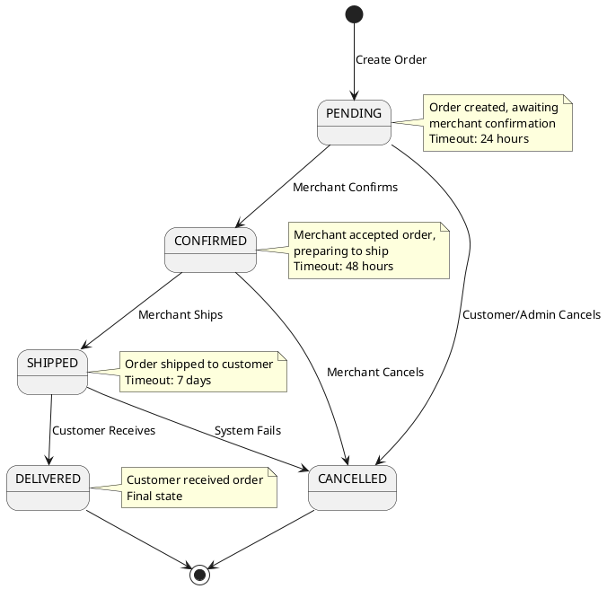
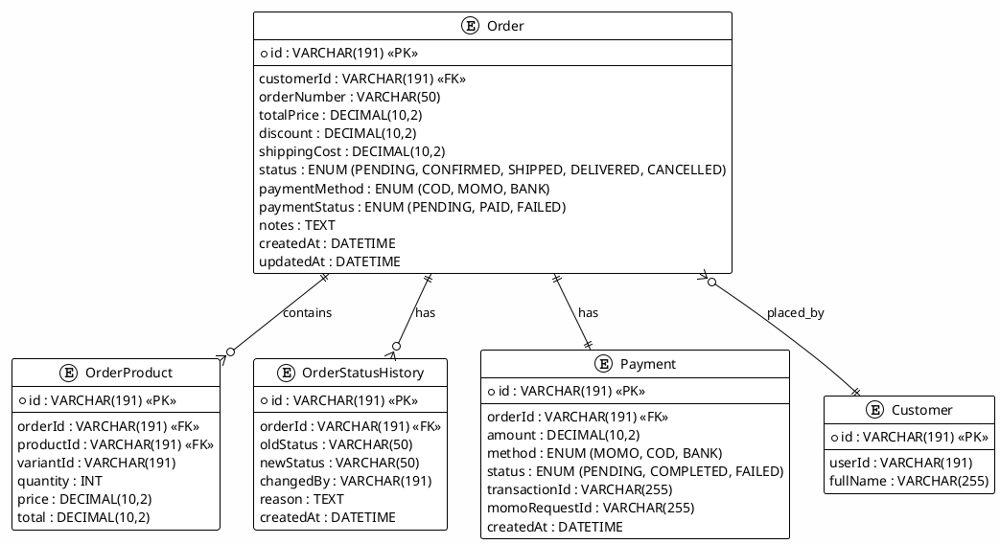

# 03_ORDERS_MODULE - Hướng Dẫn Kiểm Thử Chi Tiết

**Kiểm Thử Module Quản Lý Đơn Hàng (Order Management)**

**Phạm Vi:** UC3.1-UC3.20  
**Phiên Bản:** 1.0  
**Cập Nhật:** 7/12/2025

---

## 📋 MỤC LỤC

1. [Tổng Quan Module](#1-tổng-quan-module)
2. [Phân Tích Yêu Cầu](#2-phân-tích-yêu-cầu)
3. [Chiến Lược Kiểm Thử](#3-chiến-lược-kiểm-thử)
4. [Sơ Đồ Kiến Trúc](#4-sơ-đồ-kiến-trúc)
5. [Test Cases Chi Tiết](#5-test-cases-chi-tiết)
6. [Ví Dụ Mã](#6-ví-dụ-mã)
7. [Hướng Dẫn Thực Thi](#7-hướng-dẫn-thực-thi)

---

## 1. TỔNG QUAN MODULE

### Mục Đích

Module Orders quản lý toàn bộ vòng đời đơn hàng, bao gồm:

- **Tạo đơn hàng** từ giỏ hàng
- **Theo dõi trạng thái** đơn hàng (PENDING → CONFIRMED → SHIPPED → DELIVERED)
- **Xác nhận & Hủy** đơn hàng
- **Quản lý chi tiết** sản phẩm trong đơn hàng
- **Tích hợp thanh toán** MoMo/COD
- **Cập nhật ghi chú** và lịch sử thay đổi

### Các Thành Phần Chính

```
OrderController (API endpoints)
    ↓
OrderService (Business logic)
    ├── Order Creation
    ├── Status Management
    └── Payment Integration
    ↓
Database (Prisma ORM)
    ├── Order Model
    ├── OrderProduct Model
    └── Payment Model
```

### Stack Công Nghệ

- **Framework:** Express.js (Node.js)
- **ORM:** Prisma
- **Database:** MySQL 8.0
- **Payment Gateway:** MoMo API
- **Testing:** Jest + Supertest

---

## 2. PHÂN TÍCH YÊU CẦU

### 2.1 Chức Năng Chính (Functional Requirements)

| ID  | Chức Năng              | Chi Tiết                                     |
| --- | ---------------------- | -------------------------------------------- |
| F1  | Tạo đơn hàng           | Từ giỏ hàng, tính tổng tiền                  |
| F2  | Xem danh sách đơn hàng | Customer/Merchant xem các đơn của mình       |
| F3  | Xem chi tiết đơn hàng  | Bao gồm sản phẩm, giá, thanh toán            |
| F4  | Xác nhận đơn hàng      | Merchant confirm → CONFIRMED                 |
| F5  | Hủy đơn hàng           | Trước confirmation hoặc customer request     |
| F6  | Cập nhật trạng thái    | Merchant update: CONFIRMED→SHIPPED→DELIVERED |
| F7  | Thêm ghi chú           | Customer/Merchant add notes to order         |
| F8  | Lịch sử thay đổi       | Track all status changes with timestamp      |
| F9  | Lọc theo trạng thái    | Filter by PENDING, CONFIRMED, SHIPPED, etc.  |
| F10 | Thanh toán COD         | Mark as paid on delivery                     |
| F11 | Thanh toán MoMo        | Tích hợp MoMo payment gateway                |

### 2.2 Yêu Cầu Phi Chức Năng (Non-Functional)

| ID  | Yêu Cầu      | Tiêu Chí                               |
| --- | ------------ | -------------------------------------- |
| NF1 | Atomicity    | Order + Payment transaction atomicity  |
| NF2 | Security     | Prevent cross-merchant access          |
| NF3 | Validation   | Stock validation before order creation |
| NF4 | Notification | Send email/SMS on status change        |
| NF5 | Concurrency  | Handle simultaneous order updates      |
| NF6 | Performance  | Create order < 500ms                   |

### 2.3 Điều Kiện Bắt Đầu (Entry Criteria)

- ✅ Cart module is functional
- ✅ Product stock management working
- ✅ OrderController endpoints implemented
- ✅ Payment integration configured
- ✅ Test database with seed data

### 2.4 Tiêu Chí Kết Thúc (Exit Criteria)

- ✅ All 20 test cases Pass (UC3.1-UC3.20)
- ✅ Code coverage ≥ 80%
- ✅ Order transaction atomicity verified
- ✅ No critical bugs

---

## 3. CHIẾN LƯỢC KIỂM THỬ

### 3.1 Phân Cấp Kiểm Thử

```
Unit Tests (60%)
├── Order creation logic
├── Status validation
└── Calculation rules (total, tax)

Integration Tests (35%)
├── Order + Product relationship
├── Stock management integration
├── Payment integration
└── Database transactions

E2E Tests (5%)
└── Full order workflow (create → confirm → ship → deliver)
```

### 3.2 Kỹ Thuật Kiểm Thử Áp Dụng

#### State Transition Testing

```
PENDING (initial)
    ↓
CONFIRMED (merchant confirms)
    ↓ or → CANCELLED (before confirm)
SHIPPED (merchant marks shipped)
    ↓
DELIVERED (customer receives)

Also: CANCELLED from PENDING, CONFIRMED, SHIPPED
```

#### Boundary Value Testing

```
Order total:
- Min: 50,000 VNĐ (minimum order)
- Normal: 1,000,000 VNĐ
- Max: 50,000,000 VNĐ

Quantity per item:
- Min: 1
- Max: 1,000
```

#### Equivalence Partitioning

```
Payment methods: ["COD", "MOMO", "BANK"]
Order status: ["PENDING", "CONFIRMED", "SHIPPED", "DELIVERED", "CANCELLED"]
```

---

## 4. SƠ ĐỒ KIẾN TRÚC

### 4.1 Order Lifecycle State Machine



### 4.2 Entity Relationship Diagram



### 4.3 Order Creation Flow

```
POST /api/orders
├── 1. Validate cart & items
├── 2. Check product stock
├── 3. Calculate totals (price, tax, shipping)
├── 4. Create Order (atomic transaction)
│   ├── Create Order record
│   ├── Create OrderProduct items
│   └── Reduce stock
├── 5. Create Payment record
├── 6. Clear cart
└── 7. Return order + payment info
```

---

## 5. TEST CASES CHI TIẾT

### 5.1 Order Management (UC3.1-UC3.6)

#### **UC3.1: Tạo Đơn Hàng Từ Giỏ Hàng**

| Thuộc Tính            | Giá Trị                                       |
| --------------------- | --------------------------------------------- |
| **Mô Tả**             | Tạo đơn hàng mới từ giỏ hàng                  |
| **Điều Kiện Tiền Đề** | Customer có items trong cart, stock available |
| **Bước Thực Thi**     | 1. POST /api/orders với cartId                |
| **Kết Quả Mong Đợi**  | HTTP 201, order created with PENDING status   |
| **Dữ Liệu Kiểm Thử**  | cartId, shippingAddress, paymentMethod        |
| **Loại Test**         | Integration                                   |

**Test Cases Con:**

```javascript
// Valid order creation
POST /api/orders
Body: {
  cartId: "cart-123",
  shippingAddress: { ... },
  paymentMethod: "COD"
}
→ Status 201, order.id exists, order.status = "PENDING"

// Order with discount code
POST /api/orders
Body: { cartId, shippingAddress, discountCode: "SUMMER50" }
→ Status 201, order.discount calculated

// Insufficient stock
POST /api/orders (cart has 10 items but product has 5)
→ Status 400, { error: "Insufficient stock" }

// Empty cart
POST /api/orders { cartId: "empty-cart" }
→ Status 400, { error: "Cart is empty" }
```

#### **UC3.2: Xem Danh Sách Đơn Hàng**

```javascript
// Customer views their orders
GET /api/customers/orders?page=1&limit=10
Headers: Authorization: Bearer customerToken
→ Status 200, orders array with only their orders

// Merchant views orders from their products
GET /api/merchants/orders?status=PENDING&page=1
Headers: Authorization: Bearer merchantToken
→ Status 200, orders containing only their products

// Filter by status
GET /api/customers/orders?status=DELIVERED
→ Status 200, only DELIVERED orders
```

#### **UC3.3: Xem Chi Tiết Đơn Hàng**

```javascript
describe("Get Order Details", () => {
  test("UC3.3: Should return full order details", async () => {
    const res = await request(app)
      .get(`/api/orders/ord-123`)
      .set("Authorization", `Bearer ${customerToken}`);

    expect(res.status).toBe(200);
    expect(res.body).toHaveProperty("id", "ord-123");
    expect(res.body).toHaveProperty("products"); // OrderProduct[]
    expect(res.body).toHaveProperty("payment"); // Payment info
    expect(res.body).toHaveProperty("statusHistory"); // History[]
  });

  test("Should prevent cross-customer access", async () => {
    const res = await request(app)
      .get(`/api/orders/other-customer-order`)
      .set("Authorization", `Bearer ${differentCustomerToken}`);

    expect(res.status).toBe(403);
  });
});
```

#### **UC3.4: Xác Nhận Đơn Hàng (Merchant)**

```javascript
describe("Confirm Order", () => {
  test("UC3.4: Merchant confirms pending order", async () => {
    const res = await request(app)
      .put(`/api/orders/ord-123/confirm`)
      .set("Authorization", `Bearer ${merchantToken}`)
      .send({ notes: "Ready to ship" });

    expect(res.status).toBe(200);
    expect(res.body.status).toBe("CONFIRMED");
    expect(res.body.statusHistory).toContainEqual(
      expect.objectContaining({
        oldStatus: "PENDING",
        newStatus: "CONFIRMED",
      })
    );
  });

  test("Should not confirm non-PENDING orders", async () => {
    const res = await request(app)
      .put(`/api/orders/ord-confirmed/confirm`)
      .set("Authorization", `Bearer ${merchantToken}`);

    expect(res.status).toBe(400);
    expect(res.body.error).toContain("already confirmed");
  });

  test("Should not allow other merchant to confirm", async () => {
    const res = await request(app)
      .put(`/api/orders/ord-123/confirm`)
      .set("Authorization", `Bearer ${differentMerchantToken}`);

    expect(res.status).toBe(403);
  });
});
```

#### **UC3.5: Hủy Đơn Hàng (Customer)**

```javascript
describe("Cancel Order", () => {
  test("UC3.5: Customer cancels PENDING order", async () => {
    const res = await request(app)
      .put(`/api/orders/ord-123/cancel`)
      .set("Authorization", `Bearer ${customerToken}`)
      .send({ reason: "Changed my mind" });

    expect(res.status).toBe(200);
    expect(res.body.status).toBe("CANCELLED");
  });

  test("Should restore product stock on cancel", async () => {
    // Before: product stock = 100, order qty = 5
    // Cancel order
    // After: stock should be restored to 105

    const product = await prisma.product.findUnique({
      where: { id: "prod-123" },
    });
    expect(product.stock).toBe(105);
  });

  test("Should not allow cancel DELIVERED orders", async () => {
    const res = await request(app)
      .put(`/api/orders/ord-delivered/cancel`)
      .set("Authorization", `Bearer ${customerToken}`);

    expect(res.status).toBe(400);
  });
});
```

#### **UC3.6: Hủy Đơn Hàng (Merchant)**

```javascript
describe("Merchant Cancel Order", () => {
  test("Merchant can cancel unshipped orders", async () => {
    const res = await request(app)
      .put(`/api/orders/ord-123/cancel`)
      .set("Authorization", `Bearer ${merchantToken}`)
      .send({ reason: "Out of stock now" });

    expect(res.status).toBe(200);
    expect(res.body.cancelledBy).toBe("MERCHANT");
  });

  test("Should notify customer on cancellation", async () => {
    // Mock: Check notification sent
    expect(notificationSpy).toHaveBeenCalledWith({
      customerId: "cust-123",
      message: "Order cancelled",
      orderId: "ord-123",
    });
  });
});
```

### 5.2 Status Updates (UC3.7-UC3.10)

#### **UC3.7: Cập Nhật Trạng Thái (PENDING → CONFIRMED)**

```javascript
test("Update status to CONFIRMED", async () => {
  const res = await request(app)
    .patch(`/api/orders/ord-123/status`)
    .set("Authorization", `Bearer ${merchantToken}`)
    .send({ status: "CONFIRMED" });

  expect(res.status).toBe(200);
  expect(res.body.status).toBe("CONFIRMED");
});
```

#### **UC3.8: Cập Nhật Trạng Thái (CONFIRMED → SHIPPED)**

```javascript
test("Update status to SHIPPED", async () => {
  const res = await request(app)
    .patch(`/api/orders/ord-confirmed/status`)
    .set("Authorization", `Bearer ${merchantToken}`)
    .send({
      status: "SHIPPED",
      trackingNumber: "VJT123456789",
    });

  expect(res.status).toBe(200);
  expect(res.body.status).toBe("SHIPPED");
  expect(res.body.trackingNumber).toBe("VJT123456789");
});
```

#### **UC3.9: Cập Nhật Trạng Thái (SHIPPED → DELIVERED)**

```javascript
test("Update status to DELIVERED", async () => {
  const res = await request(app)
    .patch(`/api/orders/ord-shipped/status`)
    .set("Authorization", `Bearer ${customerToken}`)
    .send({ status: "DELIVERED" });

  expect(res.status).toBe(200);
  expect(res.body.status).toBe("DELIVERED");
});
```

#### **UC3.10: Invalid Status Transition**

```javascript
test("Prevent invalid status transitions", async () => {
  // Try to jump from PENDING to DELIVERED (skip CONFIRMED & SHIPPED)
  const res = await request(app)
    .patch(`/api/orders/ord-123/status`)
    .set("Authorization", `Bearer ${merchantToken}`)
    .send({ status: "DELIVERED" });

  expect(res.status).toBe(400);
  expect(res.body.error).toContain("Cannot transition");
});

test("Invalid status value", async () => {
  const res = await request(app)
    .patch(`/api/orders/ord-123/status`)
    .send({ status: "INVALID_STATUS" });

  expect(res.status).toBe(400);
});
```

### 5.3 Order Notes & History (UC3.11-UC3.13)

#### **UC3.11: Thêm Ghi Chú Đơn Hàng**

```javascript
describe("Add Order Notes", () => {
  test("UC3.11: Add note to order", async () => {
    const res = await request(app)
      .post(`/api/orders/ord-123/notes`)
      .set("Authorization", `Bearer ${customerToken}`)
      .send({
        content: "Please ring bell when delivery",
        type: "DELIVERY_NOTE",
      });

    expect(res.status).toBe(201);
    expect(res.body.notes).toContainEqual(
      expect.objectContaining({
        content: "Please ring bell when delivery",
        addedBy: "CUSTOMER",
      })
    );
  });

  test("Merchant can add notes too", async () => {
    const res = await request(app)
      .post(`/api/orders/ord-123/notes`)
      .set("Authorization", `Bearer ${merchantToken}`)
      .send({
        content: "Item verified and packed",
        type: "INTERNAL",
      });

    expect(res.status).toBe(201);
  });
});
```

#### **UC3.12: Xem Lịch Sử Thay Đổi**

```javascript
test("UC3.12: Retrieve order status history", async () => {
  const res = await request(app)
    .get(`/api/orders/ord-123/history`)
    .set("Authorization", `Bearer ${customerToken}`);

  expect(res.status).toBe(200);
  expect(Array.isArray(res.body)).toBe(true);
  expect(res.body[0]).toEqual(
    expect.objectContaining({
      oldStatus: "PENDING",
      newStatus: "CONFIRMED",
      changedBy: expect.any(String),
      createdAt: expect.any(String),
    })
  );
});
```

#### **UC3.13: Lọc Theo Trạng Thái**

```javascript
test("UC3.13: Filter orders by status", async () => {
  const res = await request(app)
    .get(`/api/orders?status=SHIPPED&page=1`)
    .set("Authorization", `Bearer ${customerToken}`);

  expect(res.status).toBe(200);
  res.body.data.forEach((order) => {
    expect(order.status).toBe("SHIPPED");
  });
});
```

### 5.4 Payment Integration (UC3.14-UC3.20)

#### **UC3.14: Thanh Toán COD (Cash on Delivery)**

```javascript
describe("COD Payment", () => {
  test("UC3.14: Create order with COD", async () => {
    const res = await request(app)
      .post("/api/orders")
      .set("Authorization", `Bearer ${customerToken}`)
      .send({
        cartId: "cart-123",
        paymentMethod: "COD",
      });

    expect(res.status).toBe(201);
    expect(res.body.paymentStatus).toBe("PENDING");
    expect(res.body.paymentMethod).toBe("COD");
  });

  test("Mark COD as paid on delivery", async () => {
    const res = await request(app)
      .patch(`/api/orders/ord-123/payment/confirm`)
      .set("Authorization", `Bearer ${merchantToken}`)
      .send({ paymentStatus: "PAID" });

    expect(res.status).toBe(200);
    expect(res.body.paymentStatus).toBe("PAID");
  });
});
```

#### **UC3.15: Thanh Toán MoMo**

```javascript
describe("MoMo Payment", () => {
  test("UC3.15: Initiate MoMo payment", async () => {
    const res = await request(app)
      .post("/api/orders")
      .set("Authorization", `Bearer ${customerToken}`)
      .send({
        cartId: "cart-123",
        paymentMethod: "MOMO",
        momoPhone: "0987654321",
      });

    expect(res.status).toBe(201);
    expect(res.body.momoPaymentUrl).toBeDefined();
    expect(res.body.paymentStatus).toBe("PENDING");
  });

  test("Verify MoMo callback", async () => {
    // Simulate MoMo webhook callback
    const res = await request(app).post("/api/webhooks/momo/callback").send({
      orderId: "ord-123",
      transactionId: "momo-trans-123",
      resultCode: 0, // Success
      amount: 1500000,
    });

    expect(res.status).toBe(200);

    // Verify order payment status updated
    const order = await prisma.order.findUnique({
      where: { id: "ord-123" },
    });
    expect(order.paymentStatus).toBe("PAID");
  });

  test("Handle MoMo payment failure", async () => {
    const res = await request(app).post("/api/webhooks/momo/callback").send({
      orderId: "ord-123",
      resultCode: 1001, // Failed
    });

    expect(res.status).toBe(200);

    const order = await prisma.order.findUnique({
      where: { id: "ord-123" },
    });
    expect(order.paymentStatus).toBe("FAILED");
  });
});
```

#### **UC3.16: Thanh Toán Bank Transfer**

```javascript
test("UC3.16: Create order with bank transfer", async () => {
  const res = await request(app)
    .post("/api/orders")
    .set("Authorization", `Bearer ${customerToken}`)
    .send({
      cartId: "cart-123",
      paymentMethod: "BANK",
      bankCode: "VIETCOMBANK",
    });

  expect(res.status).toBe(201);
  expect(res.body.bankTransferDetails).toBeDefined();
  expect(res.body.bankTransferDetails.accountName).toBe("Ecommerce Store");
});
```

#### **UC3.17: Refund Payment**

```javascript
describe("Refund Payment", () => {
  test("UC3.17: Request refund for PAID order", async () => {
    const res = await request(app)
      .post(`/api/orders/ord-123/refund`)
      .set("Authorization", `Bearer ${customerToken}`)
      .send({ reason: "Changed mind" });

    expect(res.status).toBe(200);
    expect(res.body.refundStatus).toBe("PENDING");
  });

  test("Process refund after cancellation", async () => {
    // Cancel order
    await request(app)
      .put(`/api/orders/ord-123/cancel`)
      .set("Authorization", `Bearer ${customerToken}`);

    // Check refund created
    const refund = await prisma.refund.findUnique({
      where: { orderId: "ord-123" },
    });
    expect(refund).toBeDefined();
    expect(refund.amount).toBe(order.totalPrice);
  });
});
```

#### **UC3.18: Negative Tests - Payment Issues**

```javascript
test("UC3.18: Prevent double payment", async () => {
  // Already marked as PAID
  const res = await request(app)
    .patch(`/api/orders/ord-paid/payment/confirm`)
    .set("Authorization", `Bearer ${merchantToken}`)
    .send({ paymentStatus: "PAID" });

  expect(res.status).toBe(400);
  expect(res.body.error).toContain("already paid");
});

test("Prevent payment for cancelled orders", async () => {
  // Cancel first
  await request(app)
    .put(`/api/orders/ord-123/cancel`)
    .set("Authorization", `Bearer ${customerToken}`);

  // Try to pay
  const res = await request(app)
    .patch(`/api/orders/ord-123/payment/confirm`)
    .set("Authorization", `Bearer ${merchantToken}`)
    .send({ paymentStatus: "PAID" });

  expect(res.status).toBe(400);
});
```

#### **UC3.19: Payment Timeout Handling**

```javascript
test("UC3.19: Handle MoMo payment timeout", async () => {
  // Create order waiting for MoMo payment
  const order = await request(app)
    .post("/api/orders")
    .send({ paymentMethod: "MOMO" });

  // Wait >15 minutes without callback
  jest.useFakeTimers();
  jest.advanceTimersByTime(15 * 60 * 1000);

  // System should auto-cancel or mark as failed
  const updatedOrder = await prisma.order.findUnique({
    where: { id: order.body.id },
  });
  expect(["CANCELLED", "FAILED"]).toContain(updatedOrder.status);
});
```

#### **UC3.20: Atomic Transaction Verification**

```javascript
test("UC3.20: Verify order creation is atomic", async () => {
  // If payment fails, entire order should be rolled back
  const initialStock = (
    await prisma.product.findUnique({
      where: { id: "prod-123" },
    })
  ).stock;

  // Attempt order that fails at payment step
  const res = await request(app).post("/api/orders").send({
    cartId: "cart-123",
    paymentMethod: "MOMO",
    // Trigger payment failure...
  });

  // Stock should NOT be reduced if order failed
  const currentStock = (
    await prisma.product.findUnique({
      where: { id: "prod-123" },
    })
  ).stock;

  expect(currentStock).toBe(initialStock);
});
```

---

## 6. VÍ DỤ MÃ

### 6.1 Order Service Implementation

```javascript
// backend/services/OrderService.js

class OrderService {
  async createOrder(customerId, cartId, paymentMethod, shippingAddress) {
    try {
      // 1. Validate cart
      const cart = await prisma.cart.findUnique({
        where: { id: cartId, customerId },
        include: { items: { include: { variant: true } } },
      });

      if (!cart || cart.items.length === 0) {
        throw new Error("Cart is empty");
      }

      // 2. Check stock for all items
      for (const item of cart.items) {
        if (item.variant.stock < item.quantity) {
          throw new Error(`Insufficient stock for ${item.variant.name}`);
        }
      }

      // 3. Calculate totals
      const subtotal = cart.items.reduce(
        (sum, item) => sum + item.variant.price * item.quantity,
        0
      );
      const shippingCost = this.calculateShipping(shippingAddress);
      const tax = subtotal * 0.1; // 10% tax
      const totalPrice = subtotal + shippingCost + tax;

      // 4. Atomic transaction: Create order + reduce stock
      const order = await prisma.$transaction(async (tx) => {
        // Create order
        const newOrder = await tx.order.create({
          data: {
            customerId,
            orderNumber: this.generateOrderNumber(),
            totalPrice,
            shippingCost,
            tax,
            status: "PENDING",
            paymentMethod,
            paymentStatus: "PENDING",
            shippingAddress: JSON.stringify(shippingAddress),
            products: {
              createMany: {
                data: cart.items.map((item) => ({
                  productId: item.product.id,
                  variantId: item.variant.id,
                  quantity: item.quantity,
                  price: item.variant.price,
                  total: item.variant.price * item.quantity,
                })),
              },
            },
          },
          include: { products: true },
        });

        // Reduce stock
        for (const item of cart.items) {
          await tx.productVariant.update({
            where: { id: item.variant.id },
            data: { stock: { decrement: item.quantity } },
          });
        }

        // Create payment record
        await tx.payment.create({
          data: {
            orderId: newOrder.id,
            amount: totalPrice,
            method: paymentMethod,
            status: "PENDING",
          },
        });

        // Create status history
        await tx.orderStatusHistory.create({
          data: {
            orderId: newOrder.id,
            oldStatus: null,
            newStatus: "PENDING",
            changedBy: customerId,
            reason: "Order created",
          },
        });

        // Clear cart
        await tx.cart.update({
          where: { id: cartId },
          data: { items: { deleteMany: {} } },
        });

        return newOrder;
      });

      return order;
    } catch (error) {
      throw error;
    }
  }

  async updateStatus(orderId, newStatus, changedBy) {
    try {
      const order = await prisma.order.findUnique({
        where: { id: orderId },
      });

      // Validate transition
      const validTransitions = {
        PENDING: ["CONFIRMED", "CANCELLED"],
        CONFIRMED: ["SHIPPED", "CANCELLED"],
        SHIPPED: ["DELIVERED", "CANCELLED"],
        DELIVERED: [],
        CANCELLED: [],
      };

      if (!validTransitions[order.status].includes(newStatus)) {
        throw new Error(
          `Cannot transition from ${order.status} to ${newStatus}`
        );
      }

      // Update order & create history
      const updated = await prisma.$transaction(async (tx) => {
        const updatedOrder = await tx.order.update({
          where: { id: orderId },
          data: { status: newStatus },
        });

        await tx.orderStatusHistory.create({
          data: {
            orderId,
            oldStatus: order.status,
            newStatus,
            changedBy,
            reason: `Status updated to ${newStatus}`,
          },
        });

        // If cancelled, restore stock
        if (newStatus === "CANCELLED") {
          const orderProducts = await tx.orderProduct.findMany({
            where: { orderId },
          });

          for (const op of orderProducts) {
            await tx.productVariant.update({
              where: { id: op.variantId },
              data: { stock: { increment: op.quantity } },
            });
          }
        }

        return updatedOrder;
      });

      return updated;
    } catch (error) {
      throw error;
    }
  }

  async handleMoMoCallback(data) {
    const { orderId, transactionId, resultCode } = data;

    const order = await prisma.order.findUnique({
      where: { id: orderId },
    });

    if (!order) {
      throw new Error("Order not found");
    }

    // resultCode: 0 = success, non-zero = failed
    const paymentStatus = resultCode === 0 ? "PAID" : "FAILED";

    await prisma.order.update({
      where: { id: orderId },
      data: {
        paymentStatus,
        payment: {
          update: {
            where: { orderId },
            data: {
              status: paymentStatus,
              transactionId,
              momoRequestId: transactionId,
            },
          },
        },
      },
    });
  }
}

module.exports = new OrderService();
```

### 6.2 Test File (Jest Example)

```javascript
// backend/tests/integration/order.test.js

const request = require("supertest");
const app = require("../../app");
const { prisma } = require("../../lib/prisma");

describe("Order Controller", () => {
  let customerId, merchantToken, customerToken, orderId;

  beforeAll(async () => {
    customerToken = generateToken({ id: "cust-1", role: "customer" });
    merchantToken = generateToken({ id: "merchant-1", role: "merchant" });
    customerId = "cust-1";
  });

  describe("POST /api/orders", () => {
    test("UC3.1: Should create order from cart", async () => {
      const res = await request(app)
        .post("/api/orders")
        .set("Authorization", `Bearer ${customerToken}`)
        .send({
          cartId: "cart-123",
          shippingAddress: {
            street: "123 Main St",
            city: "Ho Chi Minh",
            zip: "700000",
          },
          paymentMethod: "COD",
        });

      expect(res.status).toBe(201);
      expect(res.body.status).toBe("PENDING");
      expect(res.body.totalPrice).toBeGreaterThan(0);
      orderId = res.body.id;
    });
  });

  describe("GET /api/orders", () => {
    test("UC3.2: Should list customer orders", async () => {
      const res = await request(app)
        .get("/api/orders?page=1&limit=10")
        .set("Authorization", `Bearer ${customerToken}`);

      expect(res.status).toBe(200);
      expect(Array.isArray(res.body.data)).toBe(true);
    });
  });

  describe("PUT /api/orders/:id/confirm", () => {
    test("UC3.4: Merchant confirms order", async () => {
      const res = await request(app)
        .put(`/api/orders/${orderId}/confirm`)
        .set("Authorization", `Bearer ${merchantToken}`)
        .send({ notes: "Processing" });

      expect(res.status).toBe(200);
      expect(res.body.status).toBe("CONFIRMED");
    });
  });

  describe("Payment Tests", () => {
    test("UC3.15: MoMo payment callback", async () => {
      const res = await request(app).post("/api/webhooks/momo/callback").send({
        orderId,
        resultCode: 0,
        transactionId: "momo-123",
      });

      expect(res.status).toBe(200);
    });
  });
});
```

---

## 7. HƯỚNG DẪN THỰC THI

### 7.1 Chuẩn Bị Test Environment

```bash
# 1. Setup test database
npm run db:seed:test

# 2. Create test orders
npm run db:seed:test -- --module=orders

# 3. Configure MoMo sandbox
export MOMO_ENDPOINT=https://test-payment.momo.vn
export MOMO_PARTNER_CODE=test_code
```

### 7.2 Chạy Tests

```bash
# All order tests
npm test -- order.test.js

# Specific test
npm test -- order.test.js -t "UC3.1"

# With coverage
npm test -- order.test.js --coverage

# Watch mode
npm test -- order.test.js --watch
```

### 7.3 Debugging Payment Tests

```javascript
// Enable request logging for MoMo calls
process.env.DEBUG=momo:*

// Mock MoMo API
jest.mock('axios', () => ({
  post: jest.fn().mockResolvedValue({
    data: { resultCode: 0 }
  })
}));
```

---

## 📚 LIÊN KẾT LIÊN QUAN

- **Test Plan:** [docs/testing/TEST_PLAN.md](../TEST_PLAN.md)
- **Payment Integration:** [MOMO_INTEGRATION_GUIDE.md](../../MOMO_INTEGRATION_GUIDE.md)
- **Order API Routes:** `backend/routes/orders.js`
- **Order Controller:** `backend/controllers/customer_orders.js`

---

**Phiên Bản:** 1.0  
**Cập Nhật:** 7/12/2025  
**Trạng Thái:** ✅ Ready for Testing
