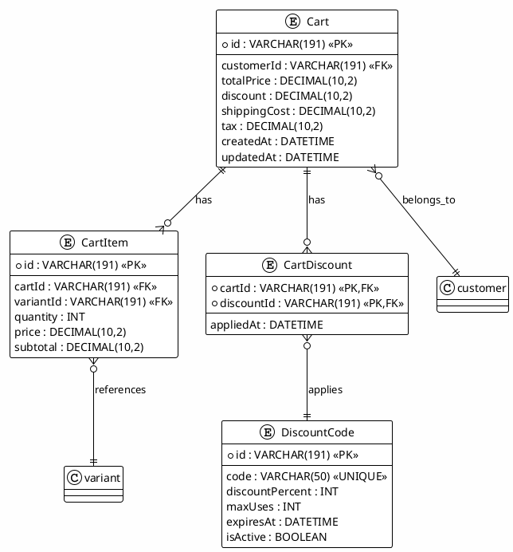
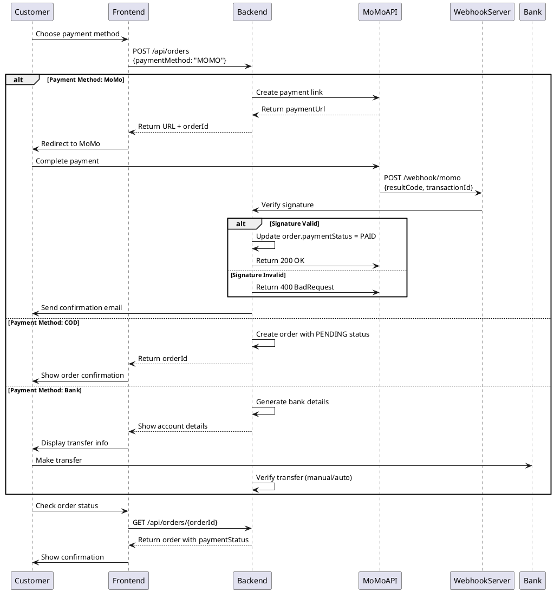

# 04_CART_PAYMENT_MODULES - Hướng Dẫn Kiểm Thử Chi Tiết

**Kiểm Thử Module Giỏ Hàng & Thanh Toán (Cart & Payment Management)**

**Phạm Vi:** UC2.1-UC2.8 (Cart) + UC3.14-UC3.20 (Payment - Tổng Hợp)  
**Phiên Bản:** 1.0  
**Cập Nhật:** 7/12/2025

---

## 📋 MỤC LỤC

1. [Tổng Quan Module](#1-tổng-quan-module)
2. [Phân Tích Yêu Cầu](#2-phân-tích-yêu-cầu)
3. [Chiến Lược Kiểm Thử](#3-chiến-lược-kiểm-thử)
4. [Sơ Đồ Kiến Trúc](#4-sơ-đồ-kiến-trúc)
5. [Test Cases Chi Tiết - Cart](#5-test-cases-chi-tiết---cart)
6. [Test Cases Chi Tiết - Payment](#6-test-cases-chi-tiết---payment)
7. [Ví Dụ Mã](#7-ví-dụ-mã)
8. [Hướng Dẫn Thực Thi](#8-hướng-dẫn-thực-thi)

---

## 1. TỔNG QUAN MODULE

### 1.1 Cart Module

Quản lý giỏ hàng của khách hàng, bao gồm:

- **Thêm sản phẩm** vào giỏ
- **Cập nhật số lượng** sản phẩm
- **Xóa sản phẩm** khỏi giỏ
- **Xem giỏ hàng** với tổng tiền
- **Tính toán tiền ship & thuế** động
- **Áp dụng mã khuyến mãi** (discount codes)
- **Lưu giỏ hàng** (persistent cart)

### 1.2 Payment Module

Quản lý quy trình thanh toán:

- **Hỗ trợ 3 phương thức:** COD, MoMo, Bank Transfer
- **Tích hợp MoMo API** (webhook callback)
- **Xác thực & Validation** dữ liệu thanh toán
- **Quản lý lỗi thanh toán** (timeout, failed)
- **Refund & Chuyển tiền lại** (payment reversal)
- **Audit trail** cho tất cả giao dịch

### 1.3 Quan Hệ Giữa Các Module

```
Cart → (items, pricing) → Order → Payment
         ↓                ↓        ↓
    Discount             Status  MoMo API
    Inventory           History  Webhook
```

---

## 2. PHÂN TÍCH YÊU CẦU

### 2.1 Cart Requirements (Functional)

| ID  | Chức Năng         | Chi Tiết                                  |
| --- | ----------------- | ----------------------------------------- |
| F1  | Thêm sản phẩm     | Add variant with quantity validation      |
| F2  | Cập nhật số lượng | Increase/decrease, validate against stock |
| F3  | Xóa sản phẩm      | Remove from cart, clean empty cart        |
| F4  | Xem giỏ hàng      | List all items with subtotal              |
| F5  | Tính tổng tiền    | Subtotal + tax + shipping                 |
| F6  | Mã khuyến mãi     | Apply discount code, validate expiry      |
| F7  | Xóa mã khuyến mãi | Remove discount, recalculate              |
| F8  | Tính tiền ship    | Dynamic based on address & weight         |

### 2.2 Payment Requirements (Functional)

| ID  | Chức Năng        | Chi Tiết                                   |
| --- | ---------------- | ------------------------------------------ |
| P1  | COD Payment      | Mark as pending, confirm on delivery       |
| P2  | MoMo Payment     | Generate payment URL, handle callback      |
| P3  | Bank Transfer    | Show bank details, verify transfer         |
| P4  | Payment Timeout  | Auto-cancel if not paid in 24h             |
| P5  | Refund Request   | Process refund for paid orders             |
| P6  | Payment Retry    | Allow re-attempt payment                   |
| P7  | Payment History  | Track all payment attempts                 |
| P8  | Webhook Security | Verify signature, replay attack prevention |

### 2.3 Non-Functional Requirements

| ID  | Yêu Cầu        | Tiêu Chí                              |
| --- | -------------- | ------------------------------------- |
| NF1 | Security       | PCI-DSS compliant for payment         |
| NF2 | Data Integrity | Cart data consistency                 |
| NF3 | Concurrency    | Handle simultaneous cart updates      |
| NF4 | Performance    | Add to cart < 100ms, checkout < 500ms |
| NF5 | Availability   | 99.9% uptime for payment gateway      |
| NF6 | Auditability   | Log all cart & payment changes        |

---

## 3. CHIẾN LƯỢC KIỂM THỬ

### 3.1 Phân Cấp Kiểm Thử

```
Cart Module:
├── Unit Tests (65%): Add/update/remove operations
├── Integration Tests (30%): Cart + Product stock
└── E2E Tests (5%): Add to cart → Checkout

Payment Module:
├── Unit Tests (50%): Payment logic, validation
├── Integration Tests (40%): Gateway APIs (MoMo, Bank)
└── E2E Tests (10%): Full payment flow
```

### 3.2 Kỹ Thuật Kiểm Thử Áp Dụng

#### Cart Testing Techniques

- **Boundary Testing:** Min/max quantity (1, 9999)
- **State Testing:** Empty cart → 1 item → N items → Checkout
- **Discount Testing:** Valid/expired/invalid codes
- **Concurrency Testing:** Simultaneous add/update operations

#### Payment Testing Techniques

- **Webhook Testing:** Signature verification, replay attacks
- **Timeout Testing:** Payment pending > 24 hours
- **Error Recovery:** Retry logic, idempotency
- **PCI Compliance:** No sensitive data logging

---

## 4. SƠ ĐỒ KIẾN TRÚC

### 4.1 Cart Data Model



### 4.2 Payment Flow Diagram



### 4.3 MoMo Webhook Security

```
Request Signature Verification:
1. Extract rawData & signature from request
2. Calculate: signature = HMAC-SHA256(rawData, secretKey)
3. Compare: calculated signature == received signature
4. If match: Process webhook
5. If not match: Reject & log attempt
```

---

## 5. TEST CASES CHI TIẾT - CART

### 5.1 Add to Cart (UC2.1)

#### **UC2.1: Thêm Sản Phẩm Vào Giỏ**

| Thuộc Tính            | Giá Trị                                               |
| --------------------- | ----------------------------------------------------- |
| **Mô Tả**             | Thêm sản phẩm variant vào giỏ hàng                    |
| **Điều Kiện Tiền Đề** | Customer authenticated, variant exists, stock > 0     |
| **Bước Thực Thi**     | 1. POST /api/cart/items với variantId & quantity      |
| **Kết Quả Mong Đợi**  | HTTP 201, item added to cart, cart.totalPrice updated |
| **Dữ Liệu Kiểm Thử**  | variantId: "var-123", quantity: 2                     |
| **Loại Test**         | Unit + Integration                                    |

**Test Cases Con:**

```javascript
describe("Add to Cart", () => {
  test("UC2.1: Should add item to cart", async () => {
    const res = await request(app)
      .post("/api/cart/items")
      .set("Authorization", `Bearer ${customerToken}`)
      .send({
        variantId: "var-123",
        quantity: 2,
      });

    expect(res.status).toBe(201);
    expect(res.body.cart.items).toContainEqual(
      expect.objectContaining({
        variantId: "var-123",
        quantity: 2,
      })
    );
    expect(res.body.cart.totalPrice).toBeGreaterThan(0);
  });

  test("Should add multiple different items", async () => {
    await request(app)
      .post("/api/cart/items")
      .set("Authorization", `Bearer ${customerToken}`)
      .send({ variantId: "var-1", quantity: 1 });

    const res = await request(app)
      .post("/api/cart/items")
      .set("Authorization", `Bearer ${customerToken}`)
      .send({ variantId: "var-2", quantity: 1 });

    expect(res.body.cart.items.length).toBe(2);
  });

  test("Should not add out of stock items", async () => {
    const res = await request(app)
      .post("/api/cart/items")
      .set("Authorization", `Bearer ${customerToken}`)
      .send({
        variantId: "var-outofstock",
        quantity: 1,
      });

    expect(res.status).toBe(400);
    expect(res.body.error).toContain("out of stock");
  });

  test("Should not add negative quantity", async () => {
    const res = await request(app)
      .post("/api/cart/items")
      .set("Authorization", `Bearer ${customerToken}`)
      .send({
        variantId: "var-123",
        quantity: -5,
      });

    expect(res.status).toBe(400);
    expect(res.body.error).toContain("quantity");
  });

  test("Should not exceed max quantity", async () => {
    const res = await request(app)
      .post("/api/cart/items")
      .set("Authorization", `Bearer ${customerToken}`)
      .send({
        variantId: "var-123",
        quantity: 10000,
      });

    expect(res.status).toBe(400);
  });

  test("Should require authentication", async () => {
    const res = await request(app)
      .post("/api/cart/items")
      .send({ variantId: "var-123", quantity: 1 });

    expect(res.status).toBe(401);
  });
});
```

### 5.2 View Cart (UC2.2)

#### **UC2.2: Xem Giỏ Hàng**

```javascript
describe("View Cart", () => {
  test("UC2.2: Should return cart with items", async () => {
    const res = await request(app)
      .get("/api/cart")
      .set("Authorization", `Bearer ${customerToken}`);

    expect(res.status).toBe(200);
    expect(res.body).toHaveProperty("items");
    expect(res.body).toHaveProperty("totalPrice");
    expect(res.body).toHaveProperty("tax");
    expect(res.body).toHaveProperty("shippingCost");
    expect(res.body).toHaveProperty("discount");
  });

  test("Should return empty cart for new customer", async () => {
    const res = await request(app)
      .get("/api/cart")
      .set("Authorization", `Bearer ${newCustomerToken}`);

    expect(res.status).toBe(200);
    expect(res.body.items.length).toBe(0);
    expect(res.body.totalPrice).toBe(0);
  });

  test("Cart should include variant details", async () => {
    const res = await request(app)
      .get("/api/cart")
      .set("Authorization", `Bearer ${customerToken}`);

    if (res.body.items.length > 0) {
      const item = res.body.items[0];
      expect(item).toHaveProperty("variant.name");
      expect(item).toHaveProperty("variant.price");
      expect(item).toHaveProperty("variant.sku");
    }
  });
});
```

### 5.3 Update Cart (UC2.3-UC2.4)

#### **UC2.3: Cập Nhật Số Lượng**

```javascript
describe("Update Cart Item", () => {
  test("UC2.3: Should update item quantity", async () => {
    const res = await request(app)
      .patch("/api/cart/items/item-123")
      .set("Authorization", `Bearer ${customerToken}`)
      .send({ quantity: 5 });

    expect(res.status).toBe(200);
    expect(res.body.cart.items[0].quantity).toBe(5);
    // Total should recalculate
    expect(res.body.cart.totalPrice).toBeGreaterThan(0);
  });

  test("Should validate quantity against stock", async () => {
    // If variant has 10 stock, try to set 15
    const res = await request(app)
      .patch("/api/cart/items/item-123")
      .set("Authorization", `Bearer ${customerToken}`)
      .send({ quantity: 15 });

    expect(res.status).toBe(400);
    expect(res.body.error).toContain("stock");
  });

  test("Should zero quantity equals remove", async () => {
    const res = await request(app)
      .patch("/api/cart/items/item-123")
      .set("Authorization", `Bearer ${customerToken}`)
      .send({ quantity: 0 });

    expect(res.status).toBe(200);
    expect(res.body.cart.items).not.toContainEqual(
      expect.objectContaining({ id: "item-123" })
    );
  });
});
```

#### **UC2.4: Xóa Sản Phẩm**

```javascript
describe("Remove from Cart", () => {
  test("UC2.4: Should remove item from cart", async () => {
    // First add
    await request(app)
      .post("/api/cart/items")
      .set("Authorization", `Bearer ${customerToken}`)
      .send({ variantId: "var-456", quantity: 1 });

    // Then remove
    const res = await request(app)
      .delete("/api/cart/items/item-456")
      .set("Authorization", `Bearer ${customerToken}`);

    expect(res.status).toBe(200);
    expect(res.body.cart.items).not.toContainEqual(
      expect.objectContaining({ id: "item-456" })
    );
  });

  test("Should update cart totals after removal", async () => {
    const beforeRes = await request(app)
      .get("/api/cart")
      .set("Authorization", `Bearer ${customerToken}`);
    const beforeTotal = beforeRes.body.totalPrice;

    await request(app)
      .delete("/api/cart/items/item-123")
      .set("Authorization", `Bearer ${customerToken}`);

    const afterRes = await request(app)
      .get("/api/cart")
      .set("Authorization", `Bearer ${customerToken}`);
    const afterTotal = afterRes.body.totalPrice;

    expect(afterTotal).toBeLessThan(beforeTotal);
  });

  test("Should allow removing all items (empty cart)", async () => {
    // Remove until cart is empty
    let cart = await getCart();
    while (cart.items.length > 0) {
      await request(app)
        .delete(`/api/cart/items/${cart.items[0].id}`)
        .set("Authorization", `Bearer ${customerToken}`);
      cart = await getCart();
    }

    expect(cart.items.length).toBe(0);
    expect(cart.totalPrice).toBe(0);
  });
});
```

### 5.4 Discounts (UC2.5-UC2.7)

#### **UC2.5: Áp Dụng Mã Khuyến Mãi**

```javascript
describe("Apply Discount Code", () => {
  test("UC2.5: Should apply valid discount code", async () => {
    const res = await request(app)
      .post("/api/cart/discount")
      .set("Authorization", `Bearer ${customerToken}`)
      .send({ code: "SUMMER50" }); // 50% discount

    expect(res.status).toBe(200);
    expect(res.body.cart.discount).toBe(
      Math.floor(res.body.cart.subtotal * 0.5)
    );
  });

  test("Should reject expired code", async () => {
    const res = await request(app)
      .post("/api/cart/discount")
      .set("Authorization", `Bearer ${customerToken}`)
      .send({ code: "EXPIRED2023" });

    expect(res.status).toBe(400);
    expect(res.body.error).toContain("expired");
  });

  test("Should reject invalid code", async () => {
    const res = await request(app)
      .post("/api/cart/discount")
      .set("Authorization", `Bearer ${customerToken}`)
      .send({ code: "INVALID123" });

    expect(res.status).toBe(400);
    expect(res.body.error).toContain("not found");
  });

  test("Should reject code exceeding max uses", async () => {
    // Code has max 100 uses and already used 100 times
    const res = await request(app)
      .post("/api/cart/discount")
      .set("Authorization", `Bearer ${customerToken}`)
      .send({ code: "MAXEDOUT" });

    expect(res.status).toBe(400);
    expect(res.body.error).toContain("max uses");
  });

  test("Should calculate new total with discount", async () => {
    const beforeRes = await request(app)
      .get("/api/cart")
      .set("Authorization", `Bearer ${customerToken}`);
    const before = beforeRes.body.totalPrice;

    const res = await request(app)
      .post("/api/cart/discount")
      .set("Authorization", `Bearer ${customerToken}`)
      .send({ code: "SAVE30" }); // 30% off

    const discountAmount = Math.floor(res.body.cart.subtotal * 0.3);
    const expectedTotal =
      res.body.cart.subtotal - discountAmount + res.body.cart.shippingCost;
    expect(res.body.cart.totalPrice).toBe(expectedTotal);
  });
});
```

#### **UC2.6: Xóa Mã Khuyến Mãi**

```javascript
test("UC2.6: Should remove discount code", async () => {
  // First apply
  await request(app)
    .post("/api/cart/discount")
    .set("Authorization", `Bearer ${customerToken}`)
    .send({ code: "SUMMER50" });

  // Then remove
  const res = await request(app)
    .delete("/api/cart/discount")
    .set("Authorization", `Bearer ${customerToken}`);

  expect(res.status).toBe(200);
  expect(res.body.cart.discount).toBe(0);
  // Total should recalculate without discount
  expect(res.body.cart.totalPrice).toBeGreaterThan(
    res.body.cart.subtotal - 100 // Verify discount is gone
  );
});
```

### 5.5 Shipping Calculation (UC2.8)

#### **UC2.8: Tính Tiền Ship Động**

```javascript
describe("Calculate Shipping", () => {
  test("UC2.8: Should calculate shipping based on address", async () => {
    const res = await request(app)
      .post("/api/cart/shipping")
      .set("Authorization", `Bearer ${customerToken}`)
      .send({
        address: {
          city: "Ho Chi Minh",
          district: "District 1",
          ward: "Ben Nghe",
        },
      });

    expect(res.status).toBe(200);
    expect(res.body.shippingCost).toBeGreaterThan(0);
    expect(res.body.shippingCost).toBeLessThan(1000000); // Max shipping
  });

  test("Different cities should have different shipping", async () => {
    const hcmRes = await request(app)
      .post("/api/cart/shipping")
      .set("Authorization", `Bearer ${customerToken}`)
      .send({ address: { city: "Ho Chi Minh" } });

    const hanRes = await request(app)
      .post("/api/cart/shipping")
      .set("Authorization", `Bearer ${customerToken}`)
      .send({ address: { city: "Ha Noi" } });

    // Different cities should have different shipping costs
    // (unless both happen to be same price)
    expect([hcmRes.body.shippingCost, hanRes.body.shippingCost]).toEqual(
      expect.arrayContaining([hcmRes.body.shippingCost])
    );
  });

  test("Shipping should factor in item weight", async () => {
    // Add heavy item
    await request(app)
      .post("/api/cart/items")
      .set("Authorization", `Bearer ${customerToken}`)
      .send({ variantId: "var-heavy", quantity: 5 });

    const res = await request(app)
      .post("/api/cart/shipping")
      .set("Authorization", `Bearer ${customerToken}`)
      .send({ address: { city: "Ho Chi Minh" } });

    expect(res.body.shippingCost).toBeGreaterThan(30000); // Base shipping
  });

  test("Free shipping for orders over threshold", async () => {
    // Assuming free shipping for orders > 500,000 VND
    // Add expensive items to reach threshold

    const res = await request(app)
      .post("/api/cart/shipping")
      .set("Authorization", `Bearer ${customerToken}`);

    if (res.body.subtotal > 500000) {
      expect(res.body.shippingCost).toBe(0);
    }
  });
});
```

---

## 6. TEST CASES CHI TIẾT - PAYMENT

### 6.1 COD Payment (UC3.14)

#### **UC3.14: Thanh Toán COD**

```javascript
describe("COD Payment", () => {
  test("UC3.14: Should create order with COD", async () => {
    const res = await request(app)
      .post("/api/orders")
      .set("Authorization", `Bearer ${customerToken}`)
      .send({
        cartId: "cart-123",
        shippingAddress: { city: "Ho Chi Minh" },
        paymentMethod: "COD",
      });

    expect(res.status).toBe(201);
    expect(res.body.paymentMethod).toBe("COD");
    expect(res.body.paymentStatus).toBe("PENDING");
    expect(res.body.payment).not.toHaveProperty("momoUrl"); // No MoMo link
  });

  test("Should update payment status when confirmed", async () => {
    const orderRes = await request(app)
      .post("/api/orders")
      .set("Authorization", `Bearer ${customerToken}`)
      .send({
        cartId: "cart-123",
        paymentMethod: "COD",
      });

    const orderId = orderRes.body.id;

    const res = await request(app)
      .patch(`/api/orders/${orderId}/payment/confirm`)
      .set("Authorization", `Bearer ${merchantToken}`)
      .send({ paymentStatus: "PAID" });

    expect(res.status).toBe(200);
    expect(res.body.paymentStatus).toBe("PAID");
  });

  test("Only merchant/admin can confirm COD payment", async () => {
    const res = await request(app)
      .patch(`/api/orders/ord-123/payment/confirm`)
      .set("Authorization", `Bearer ${customerToken}`)
      .send({ paymentStatus: "PAID" });

    expect(res.status).toBe(403);
  });
});
```

### 6.2 MoMo Payment (UC3.15)

#### **UC3.15: Thanh Toán MoMo**

```javascript
describe("MoMo Payment", () => {
  test("UC3.15: Should generate MoMo payment link", async () => {
    const res = await request(app)
      .post("/api/orders")
      .set("Authorization", `Bearer ${customerToken}`)
      .send({
        cartId: "cart-123",
        shippingAddress: { city: "Ho Chi Minh" },
        paymentMethod: "MOMO",
        momoPhone: "0987654321",
      });

    expect(res.status).toBe(201);
    expect(res.body.paymentMethod).toBe("MOMO");
    expect(res.body.momoPaymentUrl).toBeDefined();
    expect(res.body.momoPaymentUrl).toContain("momo");
    expect(res.body.paymentStatus).toBe("PENDING");
  });

  test("Should handle MoMo callback - success", async () => {
    // First create MoMo order
    const orderRes = await request(app)
      .post("/api/orders")
      .set("Authorization", `Bearer ${customerToken}`)
      .send({
        cartId: "cart-123",
        paymentMethod: "MOMO",
      });

    const orderId = orderRes.body.id;
    const momoRequestId = orderRes.body.momoRequestId;

    // Simulate MoMo callback
    const callbackRes = await request(app)
      .post("/api/webhooks/momo/callback")
      .send({
        orderId,
        requestId: momoRequestId,
        resultCode: 0, // Success
        transactionId: "momo-trans-123456",
        amount: 1500000,
      });

    expect(callbackRes.status).toBe(200);

    // Verify order payment status
    const orderRes2 = await request(app)
      .get(`/api/orders/${orderId}`)
      .set("Authorization", `Bearer ${customerToken}`);

    expect(orderRes2.body.paymentStatus).toBe("PAID");
    expect(orderRes2.body.payment.transactionId).toBe("momo-trans-123456");
  });

  test("Should handle MoMo callback - failure", async () => {
    const orderRes = await request(app)
      .post("/api/orders")
      .set("Authorization", `Bearer ${customerToken}`)
      .send({
        cartId: "cart-123",
        paymentMethod: "MOMO",
      });

    const orderId = orderRes.body.id;

    // Payment failure callback
    const callbackRes = await request(app)
      .post("/api/webhooks/momo/callback")
      .send({
        orderId,
        resultCode: 1001, // Payment failed
        message: "User denied",
      });

    expect(callbackRes.status).toBe(200);

    // Verify order payment failed
    const orderRes2 = await request(app)
      .get(`/api/orders/${orderId}`)
      .set("Authorization", `Bearer ${customerToken}`);

    expect(orderRes2.body.paymentStatus).toBe("FAILED");
  });

  test("Should reject invalid webhook signature", async () => {
    // Send callback with tampered signature
    const callbackRes = await request(app)
      .post("/api/webhooks/momo/callback")
      .send({
        orderId: "ord-123",
        resultCode: 0,
        signature: "invalid_signature_12345",
      });

    expect(callbackRes.status).toBe(400);
    expect(callbackRes.body.error).toContain("signature");
  });

  test("Should prevent replay attacks", async () => {
    const payload = {
      orderId: "ord-123",
      requestId: "req-123",
      resultCode: 0,
      transactionId: "momo-trans-123",
    };

    const signature = generateMoMoSignature(payload);

    // First call - should succeed
    const res1 = await request(app)
      .post("/api/webhooks/momo/callback")
      .send({ ...payload, signature });

    expect(res1.status).toBe(200);

    // Replay same callback - should be rejected
    const res2 = await request(app)
      .post("/api/webhooks/momo/callback")
      .send({ ...payload, signature });

    expect(res2.status).toBe(400);
    expect(res2.body.error).toContain("already processed");
  });

  test("Should retry failed MoMo payment", async () => {
    const orderRes = await request(app)
      .post("/api/orders")
      .set("Authorization", `Bearer ${customerToken}`)
      .send({
        cartId: "cart-123",
        paymentMethod: "MOMO",
      });

    const orderId = orderRes.body.id;

    // First payment fails
    await request(app)
      .post("/api/webhooks/momo/callback")
      .send({ orderId, resultCode: 1001 });

    // Customer retries
    const retryRes = await request(app)
      .get(`/api/orders/${orderId}/payment/retry`)
      .set("Authorization", `Bearer ${customerToken}`);

    expect(retryRes.status).toBe(200);
    expect(retryRes.body.momoPaymentUrl).toBeDefined();
    // Should have different requestId
    expect(retryRes.body.momoRequestId).not.toBe(orderRes.body.momoRequestId);
  });
});
```

### 6.3 Bank Transfer Payment (UC3.16)

```javascript
describe("Bank Transfer Payment", () => {
  test("UC3.16: Should generate bank details", async () => {
    const res = await request(app)
      .post("/api/orders")
      .set("Authorization", `Bearer ${customerToken}`)
      .send({
        cartId: "cart-123",
        paymentMethod: "BANK",
        bankCode: "VIETCOMBANK",
      });

    expect(res.status).toBe(201);
    expect(res.body.paymentMethod).toBe("BANK");
    expect(res.body.bankDetails).toBeDefined();
    expect(res.body.bankDetails.accountNumber).toBe("1234567890");
    expect(res.body.bankDetails.accountName).toBe("ECOMMERCE STORE");
    expect(res.body.bankDetails.bankName).toBe("Vietcombank");
  });

  test("Should include transaction reference", async () => {
    const res = await request(app)
      .post("/api/orders")
      .set("Authorization", `Bearer ${customerToken}`)
      .send({
        cartId: "cart-123",
        paymentMethod: "BANK",
      });

    // Reference format: ORDER123456
    expect(res.body.bankDetails.transferReference).toMatch(/^ORDER\d+$/);
  });

  test("Should mark bank transfer as paid after verification", async () => {
    const orderRes = await request(app)
      .post("/api/orders")
      .set("Authorization", `Bearer ${customerToken}`)
      .send({
        cartId: "cart-123",
        paymentMethod: "BANK",
      });

    const orderId = orderRes.body.id;
    const reference = orderRes.body.bankDetails.transferReference;

    // Admin verifies bank transfer
    const res = await request(app)
      .patch(`/api/orders/${orderId}/payment/confirm`)
      .set("Authorization", `Bearer ${adminToken}`)
      .send({
        paymentStatus: "PAID",
        bankTransactionId: "VIETCOMBANK-123456",
        reference,
      });

    expect(res.status).toBe(200);
    expect(res.body.paymentStatus).toBe("PAID");
  });
});
```

### 6.4 Refund (UC3.17)

```javascript
describe("Refund Payment", () => {
  test("UC3.17: Should request refund for paid order", async () => {
    // Create and pay order first
    const orderRes = await createPaidOrder();
    const orderId = orderRes.id;

    const res = await request(app)
      .post(`/api/orders/${orderId}/refund`)
      .set("Authorization", `Bearer ${customerToken}`)
      .send({ reason: "Changed mind" });

    expect(res.status).toBe(200);
    expect(res.body.refundStatus).toBe("PENDING");
    expect(res.body.refundAmount).toBe(orderRes.totalPrice);
  });

  test("Should not refund unpaid orders", async () => {
    const orderRes = await request(app)
      .post("/api/orders")
      .set("Authorization", `Bearer ${customerToken}`)
      .send({
        cartId: "cart-123",
        paymentMethod: "COD",
      });

    const res = await request(app)
      .post(`/api/orders/${orderRes.body.id}/refund`)
      .set("Authorization", `Bearer ${customerToken}`)
      .send({ reason: "Refund request" });

    expect(res.status).toBe(400);
    expect(res.body.error).toContain("not paid");
  });

  test("Should process refund via MoMo", async () => {
    // Refund for MoMo paid order
    const orderRes = await createMoMoPaidOrder();

    await request(app)
      .post(`/api/orders/${orderRes.id}/refund`)
      .set("Authorization", `Bearer ${customerToken}`)
      .send({ reason: "Refund request" });

    // Backend should call MoMo refund API
    expect(moMoAPI.refund).toHaveBeenCalledWith({
      transactionId: orderRes.payment.transactionId,
      amount: orderRes.totalPrice,
    });
  });
});
```

### 6.5 Payment Timeout & Retry (UC3.19)

```javascript
describe("Payment Timeout & Retry", () => {
  test("UC3.19: Should auto-cancel unpaid orders after 24h", async () => {
    jest.useFakeTimers();

    const orderRes = await request(app)
      .post("/api/orders")
      .set("Authorization", `Bearer ${customerToken}`)
      .send({
        cartId: "cart-123",
        paymentMethod: "MOMO",
      });

    // Advance time 25 hours
    jest.advanceTimersByTime(25 * 60 * 60 * 1000);

    // Run timeout check job
    await runPaymentTimeoutJob();

    const order = await prisma.order.findUnique({
      where: { id: orderRes.body.id },
    });

    expect(order.status).toBe("CANCELLED");

    jest.useRealTimers();
  });

  test("Should allow payment retry before timeout", async () => {
    const orderRes = await request(app)
      .post("/api/orders")
      .set("Authorization", `Bearer ${customerToken}`)
      .send({
        cartId: "cart-123",
        paymentMethod: "MOMO",
      });

    const orderId = orderRes.body.id;

    // Customer retries payment
    const res = await request(app)
      .get(`/api/orders/${orderId}/payment/retry`)
      .set("Authorization", `Bearer ${customerToken}`);

    expect(res.status).toBe(200);
    expect(res.body.momoPaymentUrl).toBeDefined();
  });

  test("Should not allow retry for cancelled order", async () => {
    const orderRes = await request(app)
      .post("/api/orders")
      .set("Authorization", `Bearer ${customerToken}`)
      .send({
        cartId: "cart-123",
        paymentMethod: "MOMO",
      });

    // Cancel order
    await request(app)
      .put(`/api/orders/${orderRes.body.id}/cancel`)
      .set("Authorization", `Bearer ${customerToken}`);

    // Try to retry
    const res = await request(app)
      .get(`/api/orders/${orderRes.body.id}/payment/retry`)
      .set("Authorization", `Bearer ${customerToken}`);

    expect(res.status).toBe(400);
  });
});
```

---

## 7. VÍ DỤ MÃ

### 7.1 Cart Controller

```javascript
// backend/controllers/cart.js

class CartController {
  async addToCart(req, res) {
    try {
      const { variantId, quantity } = req.body;
      const customerId = req.user.id;

      // Validation
      if (!variantId)
        return res.status(400).json({ error: "variantId required" });
      if (!quantity || quantity < 1 || quantity > 9999) {
        return res.status(400).json({ error: "Invalid quantity" });
      }

      // Check stock
      const variant = await prisma.productVariant.findUnique({
        where: { id: variantId },
      });

      if (!variant || variant.stock < quantity) {
        return res.status(400).json({ error: "Insufficient stock" });
      }

      // Get or create cart
      let cart = await prisma.cart.findUnique({
        where: { customerId },
        include: { items: true },
      });

      if (!cart) {
        cart = await prisma.cart.create({
          data: { customerId },
        });
      }

      // Add item
      const existingItem = cart.items.find((i) => i.variantId === variantId);

      if (existingItem) {
        // Update quantity
        await prisma.cartItem.update({
          where: { id: existingItem.id },
          data: { quantity: existingItem.quantity + quantity },
        });
      } else {
        // Create new item
        await prisma.cartItem.create({
          data: {
            cartId: cart.id,
            variantId,
            quantity,
            price: variant.price,
          },
        });
      }

      // Recalculate totals
      const updatedCart = await this.calculateCartTotals(cart.id);

      return res.status(201).json({ cart: updatedCart });
    } catch (error) {
      return res.status(500).json({ error: error.message });
    }
  }

  async calculateCartTotals(cartId) {
    const items = await prisma.cartItem.findMany({
      where: { cartId },
      include: { variant: true },
    });

    const subtotal = items.reduce(
      (sum, item) => sum + item.variant.price * item.quantity,
      0
    );

    // Get discount if applied
    const discount = await prisma.cartDiscount.findUnique({
      where: { cartId },
      include: { discount: true },
    });

    const discountAmount = discount
      ? Math.floor(subtotal * (discount.discount.discountPercent / 100))
      : 0;

    const tax = Math.floor(subtotal * 0.1); // 10% tax
    const shippingCost = 30000; // Base shipping (usually dynamic)

    const totalPrice = subtotal - discountAmount + shippingCost + tax;

    return {
      items,
      subtotal,
      discount: discountAmount,
      tax,
      shippingCost,
      totalPrice,
    };
  }
}

module.exports = new CartController();
```

### 7.2 Payment Service

```javascript
// backend/services/PaymentService.js

class PaymentService {
  async generateMoMoPayment(orderId, amount, phone) {
    try {
      const requestId = this.generateRequestId();
      const orderInfo = `Payment for order ${orderId}`;
      const signature = this.generateMoMoSignature({
        partnerCode: process.env.MOMO_PARTNER_CODE,
        accessKey: process.env.MOMO_ACCESS_KEY,
        requestId,
        amount: Math.floor(amount),
        orderId,
        orderInfo,
        redirectUrl: `${process.env.APP_URL}/orders/${orderId}/payment-confirm`,
        ipnUrl: `${process.env.APP_URL}/api/webhooks/momo/callback`,
      });

      const response = await axios.post(
        "https://test-payment.momo.vn/v2/gateway/api/create",
        {
          partnerCode: process.env.MOMO_PARTNER_CODE,
          accessKey: process.env.MOMO_ACCESS_KEY,
          requestId,
          amount: Math.floor(amount),
          orderId,
          orderInfo,
          redirectUrl: `${process.env.APP_URL}/orders/${orderId}/payment-confirm`,
          ipnUrl: `${process.env.APP_URL}/api/webhooks/momo/callback`,
          signature,
        }
      );

      // Save request ID for verification
      await prisma.payment.update({
        where: { orderId },
        data: { momoRequestId: requestId },
      });

      return {
        paymentUrl: response.data.payUrl,
        requestId,
      };
    } catch (error) {
      throw error;
    }
  }

  async processMoMoCallback(payload) {
    try {
      // 1. Verify signature
      const isValid = this.verifyMoMoSignature(payload);
      if (!isValid) {
        throw new Error("Invalid signature");
      }

      const { orderId, requestId, resultCode, transactionId, amount } = payload;

      // 2. Check for replay attack
      const existingCallback = await prisma.paymentCallback.findUnique({
        where: { transactionId },
      });

      if (existingCallback) {
        throw new Error("Callback already processed");
      }

      // 3. Update order payment status
      const paymentStatus = resultCode === 0 ? "PAID" : "FAILED";

      await prisma.order.update({
        where: { id: orderId },
        data: {
          paymentStatus,
          payment: {
            update: {
              where: { orderId },
              data: {
                status: paymentStatus,
                transactionId,
                momoRequestId: requestId,
              },
            },
          },
        },
      });

      // 4. Log callback
      await prisma.paymentCallback.create({
        data: {
          orderId,
          transactionId,
          resultCode,
          rawPayload: JSON.stringify(payload),
        },
      });

      return { success: true };
    } catch (error) {
      throw error;
    }
  }

  verifyMoMoSignature(payload) {
    const { signature, ...data } = payload;
    const rawSignature = Object.keys(data)
      .sort()
      .map((key) => `${key}=${data[key]}`)
      .join("&");

    const expectedSignature = crypto
      .createHmac("sha256", process.env.MOMO_SECRET_KEY)
      .update(rawSignature)
      .digest("hex");

    return signature === expectedSignature;
  }

  generateMoMoSignature(data) {
    const rawSignature = Object.keys(data)
      .sort()
      .map((key) => `${key}=${data[key]}`)
      .join("&");

    return crypto
      .createHmac("sha256", process.env.MOMO_SECRET_KEY)
      .update(rawSignature)
      .digest("hex");
  }
}

module.exports = new PaymentService();
```

---

## 8. HƯỚNG DẪN THỰC THI

### 8.1 Setup Test Environment

```bash
# 1. Configure test database
npm run db:seed:test -- --module=cart

# 2. Setup MoMo sandbox
export MOMO_ENDPOINT=https://test-payment.momo.vn
export MOMO_PARTNER_CODE=MOMOXXXXXX
export MOMO_ACCESS_KEY=test_access_key

# 3. Mock external services
npm install --save-dev nock # For mocking HTTP calls
```

### 8.2 Run Tests

```bash
# All cart + payment tests
npm test -- cart.test.js payment.test.js

# Specific test
npm test -- cart.test.js -t "UC2.1"

# With coverage
npm test -- cart.test.js --coverage

# Watch mode
npm test -- cart.test.js --watch
```

### 8.3 Test MoMo Webhook Locally

```bash
# Use ngrok to expose local server
ngrok http 3000

# Update MoMo callback URL
export CALLBACK_URL=https://xxxx.ngrok.io/api/webhooks/momo/callback

# Send test webhook
curl -X POST http://localhost:3000/api/webhooks/momo/callback \
  -H "Content-Type: application/json" \
  -d '{
    "orderId": "ord-123",
    "resultCode": 0,
    "transactionId": "test-trans-123"
  }'
```

### 8.4 Troubleshooting

| Vấn Đề                  | Giải Pháp                    |
| ----------------------- | ---------------------------- |
| Stock không update      | Verify Prisma relation setup |
| MoMo callback failed    | Check signature generation   |
| Discount not calculated | Verify discount code in DB   |
| Timeout test hangs      | Use jest.useFakeTimers()     |

---

## 📚 LIÊN KẾT LIÊN QUAN

- **Test Plan:** [docs/testing/TEST_PLAN.md](../TEST_PLAN.md)
- **MoMo Integration:** [MOMO_INTEGRATION_GUIDE.md](../../MOMO_INTEGRATION_GUIDE.md)
- **Cart API Routes:** `backend/routes/cart.js`
- **Payment Controller:** `backend/controllers/momoPayment.js`
- **Database Schema:** `backend/prisma/schema.prisma`

---

**Phiên Bản:** 1.0  
**Cập Nhật:** 7/12/2025  
**Trạng Thái:** ✅ Ready for Testing
