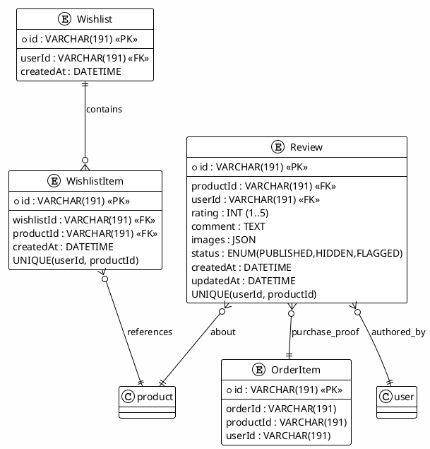

# 05_WISHLIST_REVIEWS_MODULE - Hướng Dẫn Kiểm Thử Chi Tiết

**Kiểm Thử Module Wishlist & Reviews**

**Phạm Vi:** UC5.1-UC5.12 (Wishlist), UC6.1-UC6.14 (Reviews)  
**Phiên Bản:** 1.0  
**Cập Nhật:** 7/12/2025

---

## 📋 MỤC LỤC

1. [Tổng Quan Module](#1-tổng-quan-module)
2. [Phân Tích Yêu Cầu](#2-phân-tích-yêu-cầu)
3. [Chiến Lược Kiểm Thử](#3-chiến-lược-kiểm-thử)
4. [Sơ Đồ Kiến Trúc](#4-sơ-đồ-kiến-trúc)
5. [Test Cases - Wishlist](#5-test-cases---wishlist)
6. [Test Cases - Reviews](#6-test-cases---reviews)
7. [Ví Dụ Mã](#7-ví-dụ-mã)
8. [Hướng Dẫn Thực Thi](#8-hướng-dẫn-thực-thi)

---

## 1. TỔNG QUAN MODULE

### Wishlist

- Thêm sản phẩm vào wishlist (không trùng lặp)
- Xóa sản phẩm khỏi wishlist
- Xem danh sách wishlist theo user
- Đồng bộ wishlist khi đăng nhập (guest → user)

### Reviews

- Tạo review cho sản phẩm đã mua
- Đánh giá sao (1-5), bình luận, hình ảnh
- Sửa/Xóa review (giới hạn thời gian/quyền sở hữu)
- Hiển thị review kèm phân trang, sắp xếp, lọc rating
- Chống spam, chống review trùng, kiểm duyệt nội dung

### Công Nghệ

- **Backend:** Express + Prisma + MySQL
- **Auth:** JWT (roles: customer, admin)
- **Testing:** Jest + Supertest

---

## 2. PHÂN TÍCH YÊU CẦU

### Functional - Wishlist

| ID  | Chức năng            | Ghi chú                       |
| --- | -------------------- | ----------------------------- |
| W1  | Add to wishlist      | Không trùng sản phẩm/user     |
| W2  | Remove from wishlist | Soft/Hard delete tùy DB       |
| W3  | List wishlist        | Phân trang, sort by createdAt |
| W4  | Merge guest → user   | Khi login, gộp wishlist guest |

### Functional - Reviews

| ID  | Chức năng      | Ghi chú                                          |
| --- | -------------- | ------------------------------------------------ |
| R1  | Tạo review     | Chỉ sản phẩm đã mua, 1 review/user/product       |
| R2  | Sửa review     | Trong 24-48h hoặc cho phép nếu admin             |
| R3  | Xóa review     | Owner hoặc Admin                                 |
| R4  | List reviews   | Phân trang, sort (newest, rating), filter rating |
| R5  | Đếm rating     | Tính trung bình, histogram 1-5 sao               |
| R6  | Ẩn/Flag review | Admin hide spam/offensive                        |

### Non-Functional

| ID  | Yêu cầu       | Mục tiêu                                    |
| --- | ------------- | ------------------------------------------- |
| NF1 | Hiệu suất     | List 50 reviews < 200ms                     |
| NF2 | Bảo mật       | Không sửa/xóa review của người khác         |
| NF3 | Tính toàn vẹn | Không trùng wishlist; 1 review/user/product |
| NF4 | Khả dụng      | API ổn định, retry an toàn                  |

### Entry / Exit

- Entry: DB seeded products/users, auth hoạt động, routes wishlist/reviews có sẵn
- Exit: 26 test cases pass (12 wishlist, 14 reviews), coverage ≥ 80%, không bug blocker

---

## 3. CHIẾN LƯỢC KIỂM THỬ

```
Unit (60%): validation, service logic, duplicate checks
Integration (35%): DB constraints, auth, ownership, aggregates
E2E (5%): guest→login merge wishlist, create→edit→delete review
```

Kỹ thuật: Boundary (rating 1..5), Equivalence (role admin/customer), State (review lifecycle), Security (access control), Idempotency (add wishlist same item).

---

## 4. SƠ ĐỒ KIẾN TRÚC



---

## 5. TEST CASES - WISHLIST (UC5.1-UC5.12)

### UC5.1 Add to Wishlist

- **Steps:** POST `/api/wishlist` { productId }
- **Expect:** 201, item created, no duplicates
- **Negatives:** duplicate add → 200/409 idempotent; invalid product → 404; unauth → 401

### UC5.2 Remove from Wishlist

- DELETE `/api/wishlist/{productId}` → 200, item removed
- Nonexistent item → 404; other user’s item → 403

### UC5.3 List Wishlist (Pagination)

- GET `/api/wishlist?page=1&limit=20` → 200, data ≤ limit, total/pagination metadata
- Empty wishlist → data=[]

### UC5.4 Merge Guest Wishlist on Login

- Given guest cookie has items A,B; user wishlist has C
- On login merge → wishlist contains A,B,C (deduped)

### UC5.5 Prevent Duplicate Items

- Add same product twice → item count unchanged, no duplicate row

### UC5.6 Validate Product Exists

- productId invalid → 404

### UC5.7 Soft Delete Behavior (nếu áp dụng)

- After delete, list should not return item

### UC5.8 Performance

- 100 items → list <200ms

### UC5.9 Sort By CreatedAt Desc

- Default sort newest first

### UC5.10 AuthZ

- Other user cannot delete item

### UC5.11 Bulk Add (optional)

- POST array products → all inserted, deduped

### UC5.12 Data Integrity

- UNIQUE(userId,productId) enforced (DB constraint)

---

## 6. TEST CASES - REVIEWS (UC6.1-UC6.14)

### UC6.1 Create Review (Purchased Only)

- POST `/api/reviews` { productId, rating, comment }
- Precondition: user purchased product → 201
- Not purchased → 400/403

### UC6.2 Rating Bounds

- rating=1..5 pass; 0 or 6 → 400

### UC6.3 One Review per User/Product

- Second review same user/product → 409/400

### UC6.4 Edit Review (Owner)

- PATCH `/api/reviews/{id}` → 200, fields updated
- Other user → 403; After edit window expired → 400/403 (if enforced)

### UC6.5 Delete Review

- DELETE owner/admin → 200
- Others → 403

### UC6.6 List Reviews (Pagination + Sort)

- GET `/api/products/{id}/reviews?page=1&sort=createdAt&order=desc`
- Expect pagination metadata, sorted, includes rating/comment/user (masked PII)

### UC6.7 Filter by Rating

- `?rating=5` → all rating=5
- Range `?minRating=3` → rating ≥3

### UC6.8 Average Rating & Histogram

- Validate aggregate fields: avgRating, countPerStar[1..5]

### UC6.9 Attach Images

- Upload / include image URLs → stored in JSON; validate max count/size

### UC6.10 Moderation / Hide

- Admin hides review → status=HIDDEN, review not returned to public list

### UC6.11 Flag Spam/Abuse

- POST flag → status=FLAGGED, notify admin/mod queue

### UC6.12 Performance

- 50 reviews fetch <200ms; aggregates computed via SQL, not N+1

### UC6.13 SQL/NoSQL Injection Guard

- Search/sort params sanitized; malicious input → 400

### UC6.14 XSS Protection

- Comment should be escaped/stripped; `<script>` not executed in response

---

## 7. VÍ DỤ MÃ

### 7.1 Wishlist Controller (rút gọn)

```javascript
// backend/controllers/wishlist.js
class WishlistController {
  async add(req, res) {
    const { productId } = req.body;
    if (!productId)
      return res.status(400).json({ error: "productId required" });
    const userId = req.user.id;

    // Prevent duplicate
    const exists = await prisma.wishlistItem.findFirst({
      where: { userId, productId },
    });
    if (exists) return res.status(200).json({ message: "already in wishlist" });

    const product = await prisma.product.findUnique({
      where: { id: productId },
    });
    if (!product) return res.status(404).json({ error: "Product not found" });

    const wishlist = await prisma.wishlist.upsert({
      where: { userId },
      update: {},
      create: { userId },
    });

    const item = await prisma.wishlistItem.create({
      data: { wishlistId: wishlist.id, productId, userId },
    });

    return res.status(201).json(item);
  }
}
module.exports = new WishlistController();
```

### 7.2 Reviews Controller (rút gọn)

```javascript
// backend/controllers/review.js
class ReviewController {
  async create(req, res) {
    const { productId, rating, comment, images } = req.body;
    const userId = req.user.id;

    if (!productId || !rating)
      return res.status(400).json({ error: "productId & rating required" });
    if (rating < 1 || rating > 5)
      return res.status(400).json({ error: "rating 1..5" });

    // Purchase check
    const purchased = await prisma.orderItem.findFirst({
      where: { productId, userId },
    });
    if (!purchased) return res.status(403).json({ error: "purchase required" });

    // Uniqueness
    const dup = await prisma.review.findFirst({ where: { productId, userId } });
    if (dup) return res.status(409).json({ error: "review exists" });

    const review = await prisma.review.create({
      data: { productId, userId, rating, comment, images, status: "PUBLISHED" },
    });

    return res.status(201).json(review);
  }
}
module.exports = new ReviewController();
```

### 7.3 Jest Examples

```javascript
// backend/tests/integration/wishlist.test.js

describe("Wishlist", () => {
  test("UC5.1 add to wishlist", async () => {
    const res = await request(app)
      .post("/api/wishlist")
      .set("Authorization", `Bearer ${customerToken}`)
      .send({ productId: "prod-1" });
    expect(res.status).toBe(201);
  });

  test("UC5.5 prevent duplicate", async () => {
    await request(app)
      .post("/api/wishlist")
      .set("Authorization", `Bearer ${customerToken}`)
      .send({ productId: "prod-1" });
    const res = await request(app)
      .post("/api/wishlist")
      .set("Authorization", `Bearer ${customerToken}`)
      .send({ productId: "prod-1" });
    expect([200, 409]).toContain(res.status);
  });
});
```

```javascript
// backend/tests/integration/review.test.js

describe("Reviews", () => {
  test("UC6.1 create review after purchase", async () => {
    await seedPurchase({ userId: "u1", productId: "prod-1" });
    const res = await request(app)
      .post("/api/reviews")
      .set("Authorization", `Bearer ${customerToken}`)
      .send({ productId: "prod-1", rating: 5, comment: "Great!" });
    expect(res.status).toBe(201);
    expect(res.body.rating).toBe(5);
  });

  test("UC6.2 rating bounds", async () => {
    const res = await request(app)
      .post("/api/reviews")
      .set("Authorization", `Bearer ${customerToken}`)
      .send({ productId: "prod-1", rating: 6 });
    expect(res.status).toBe(400);
  });
});
```

---

## 8. HƯỚNG DẪN THỰC THI

```bash
# Chạy wishlist tests
npm test -- wishlist.test.js

# Chạy review tests
npm test -- review.test.js

# Chạy đơn lẻ
npm test -- review.test.js -t "UC6.1"

# Coverage
npm test -- review.test.js --coverage
```

### Troubleshooting Nhanh

| Vấn đề                   | Giải pháp                                               |
| ------------------------ | ------------------------------------------------------- |
| Trùng review             | Kiểm tra UNIQUE(userId, productId) + logic trước insert |
| Rating out of range      | Validate rating 1..5 tại controller/service             |
| Không gộp wishlist guest | Kiểm tra middleware merge sau login                     |
| Chậm khi list reviews    | Thêm index productId, status; dùng `select` tránh N+1   |
| XSS trong comment        | Escape/sanitize comment trước khi trả về                |

---

**Phiên Bản:** 1.0  
**Cập Nhật:** 7/12/2025  
**Trạng Thái:** ✅ Ready for Testing
