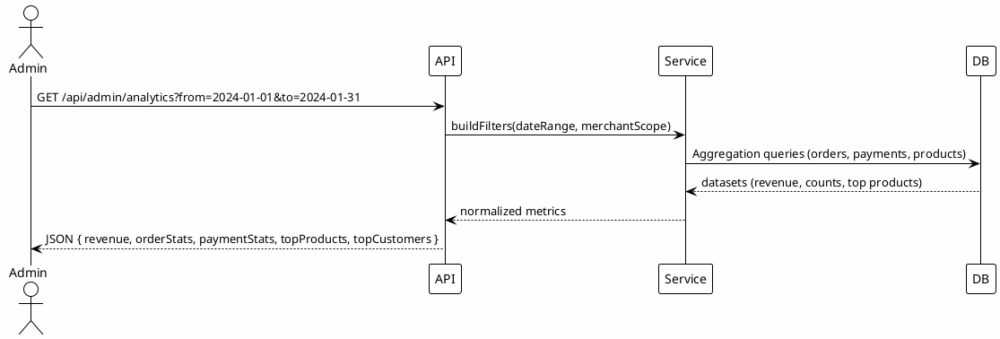

# 06_ADMIN_ANALYTICS_MODULE - Hướng Dẫn Kiểm Thử Chi Tiết

**Kiểm Thử Module Admin Analytics & Dashboard**

**Phạm Vi:** UC7.1-UC7.15  
**Phiên Bản:** 1.0  
**Cập Nhật:** 7/12/2025

---

## 📋 MỤC LỤC

1. [Tổng Quan Module](#1-tổng-quan-module)
2. [Phân Tích Yêu Cầu](#2-phân-tích-yêu-cầu)
3. [Chiến Lược Kiểm Thử](#3-chiến-lược-kiểm-thử)
4. [Sơ Đồ Kiến Trúc](#4-sơ-đồ-kiến-trúc)
5. [Test Cases Chi Tiết](#5-test-cases-chi-tiết)
6. [Ví Dụ Mã](#6-ví-dụ-mã)
7. [Hướng Dẫn Thực Thi](#7-hướng-dẫn-thực-thi)

---

## 1. TỔNG QUAN MODULE

Dashboard dành cho Admin/Merchant với các chỉ số:

- Doanh thu (theo ngày/tuần/tháng), tổng số đơn, AOV (Average Order Value)
- Top sản phẩm bán chạy, top khách hàng
- Trạng thái đơn (pending/confirmed/shipped/delivered/cancelled)
- Chuyển đổi thanh toán (MoMo/COD/Bank), tỉ lệ hoàn/huỷ
- Hiệu suất tồn kho (stock-out rate)
- Biểu đồ: line, bar, pie; export CSV

Công nghệ: Express + Prisma + MySQL (aggregation), Jest + Supertest.

---

## 2. PHÂN TÍCH YÊU CẦU

### Functional

| ID  | Chức năng                | Ghi chú                                   |
| --- | ------------------------ | ----------------------------------------- |
| A1  | Revenue summary          | dateRange, groupBy=day/week/month         |
| A2  | Order status breakdown   | counts per status                         |
| A3  | Payment method breakdown | COD/MoMo/Bank counts & revenue            |
| A4  | Top products             | limit N, filter by dateRange/category     |
| A5  | Top customers            | total spend, orders count                 |
| A6  | Conversion metrics       | checkout→paid, refund rate                |
| A7  | Export CSV               | apply same filters; headers đúng          |
| A8  | Permissions              | only admin/merchant; merchant scoped data |

### Non-Functional

| ID  | Yêu cầu   | Mục tiêu                               |
| --- | --------- | -------------------------------------- |
| NF1 | Hiệu suất | Dash API < 400ms, top products < 300ms |
| NF2 | Chính xác | Aggregates khớp DB truth (±0)          |
| NF3 | Bảo mật   | Không lộ dữ liệu cross-merchant        |
| NF4 | Ổn định   | Query lớn vẫn trả về (index hỗ trợ)    |

Entry: orders/payments seed, roles admin/merchant có token.  
Exit: 15 test cases pass, coverage ≥80%, không chênh lệch số liệu.

---

## 3. CHIẾN LƯỢC KIỂM THỬ

```
Unit (50%): query builder, date range validation, merchant scoping
Integration (45%): aggregate queries vs seeded data, permissions, CSV export
E2E (5%): full dashboard render (optional)
```

Kỹ thuật: Boundary (date range, limit), Equivalence (roles), Data correctness (expected vs seed), Performance (timing assertions), Security (scope leak).

---

## 4. SƠ ĐỒ KIẾN TRÚC



---

## 5. TEST CASES CHI TIẾT (UC7.1-UC7.15)

### UC7.1 Revenue by Day/Month

- GET `/api/admin/analytics/revenue?groupBy=day&from=2024-01-01&to=2024-01-31`
- Expect array of { date, revenue }, sum equals seeded total
- Boundary: missing from/to → default 30 days; invalid date → 400

### UC7.2 Order Status Breakdown

- GET `/api/admin/analytics/orders/status`
- Expect counts per status; sum = total orders in range

### UC7.3 Payment Method Breakdown

- GET `/api/admin/analytics/payments`
- Expect fields: codCount, momoCount, bankCount, codRevenue, ...

### UC7.4 Top Products

- GET `/api/admin/analytics/top-products?limit=5&category=electronics`
- Expect size ≤5, sorted desc by revenue/quantity; ties handled
- Merchant scope: merchant sees only own products

### UC7.5 Top Customers

- GET `/api/admin/analytics/top-customers?limit=10`
- Expect totalSpend desc; mask PII (no email/phone if policy)

### UC7.6 AOV & Conversion

- GET `/api/admin/analytics/conversion`
- Expect: aov, checkoutCount, paidCount, payConversion=paid/checkout

### UC7.7 Refund/Cancel Rate

- GET `/api/admin/analytics/refunds`
- Expect: refundRate = refundedOrders / totalOrders; cancelRate similar

### UC7.8 Date Range Validation

- from>to → 400; range > 365 days → 400 or limited

### UC7.9 Permissions

- Customer role → 403; merchant only sees scoped data

### UC7.10 CSV Export

- GET `/api/admin/analytics/export?type=top-products&format=csv`
- Headers correct, row count matches JSON version, encoding UTF-8

### UC7.11 Performance

- For seeded 10k orders → response < 400ms (can assert `res.duration` or custom timer)

### UC7.12 Pagination (where applicable)

- top-products supports page/limit; metadata present

### UC7.13 Empty Data Range

- No orders in range → zeros, empty arrays, no errors

### UC7.14 Timezone Consistency

- Dates returned in ISO UTC or consistent TZ; no off-by-one day

### UC7.15 Data Integrity Cross-Check

- Revenue = sum(orderItems - discounts + shipping - refunds where applied)

---

## 6. VÍ DỤ MÃ

### 6.1 Service (pseudo-code)

```javascript
// backend/services/adminAnalytics.js
async function getRevenue({ from, to, groupBy, merchantId }) {
  const filters = { createdAt: { gte: from, lte: to } };
  if (merchantId) filters.merchantId = merchantId;

  const rows = await prisma.order.groupBy({
    by: [groupBy === "month" ? "month" : "date"],
    where: filters,
    _sum: { totalPrice: true },
  });

  return rows.map((r) => ({
    label: r.date || r.month,
    revenue: r._sum.totalPrice,
  }));
}
```

### 6.2 Jest Integration (rút gọn)

```javascript
// backend/tests/integration/admin-analytics.test.js

describe("Admin Analytics", () => {
  test("UC7.1 revenue by day", async () => {
    const res = await request(app)
      .get(
        "/api/admin/analytics/revenue?groupBy=day&from=2024-01-01&to=2024-01-31"
      )
      .set("Authorization", `Bearer ${adminToken}`);
    expect(res.status).toBe(200);
    expect(Array.isArray(res.body.data)).toBe(true);
    expect(res.body.data[0]).toHaveProperty("revenue");
  });

  test("UC7.9 forbid customer access", async () => {
    const res = await request(app)
      .get("/api/admin/analytics/revenue")
      .set("Authorization", `Bearer ${customerToken}`);
    expect(res.status).toBe(403);
  });

  test("UC7.10 export CSV", async () => {
    const res = await request(app)
      .get("/api/admin/analytics/export?type=top-products&format=csv")
      .set("Authorization", `Bearer ${adminToken}`);
    expect(res.status).toBe(200);
    expect(res.headers["content-type"]).toContain("text/csv");
  });
});
```

### 6.3 Performance Assertion (simple)

```javascript
const start = Date.now();
const res = await request(app)
  .get("/api/admin/analytics/revenue")
  .set("Authorization", `Bearer ${adminToken}`);
const duration = Date.now() - start;
expect(duration).toBeLessThan(400);
```

---

## 7. HƯỚNG DẪN THỰC THI

```bash
# Chạy analytics tests
npm test -- admin-analytics.test.js

# Với coverage
npm test -- admin-analytics.test.js --coverage

# Chạy 1 case
npm test -- admin-analytics.test.js -t "UC7.1"
```

### Troubleshooting

| Vấn đề                       | Giải pháp                                                                      |
| ---------------------------- | ------------------------------------------------------------------------------ |
| Chậm với dữ liệu lớn         | Thêm index (createdAt, merchantId, status); dùng aggregate thay vì lấy toàn bộ |
| Sai timezone                 | Chuẩn hoá UTC trên DB & API; test snapshot TZ                                  |
| Dữ liệu sai phạm vi merchant | Bổ sung filter merchantId ở mọi query; unit test query builder                 |
| CSV lỗi font                 | Đảm bảo UTF-8, thêm BOM nếu cần                                                |

---

**Phiên Bản:** 1.0  
**Cập Nhật:** 7/12/2025  
**Trạng Thái:** ✅ Ready for Testing
