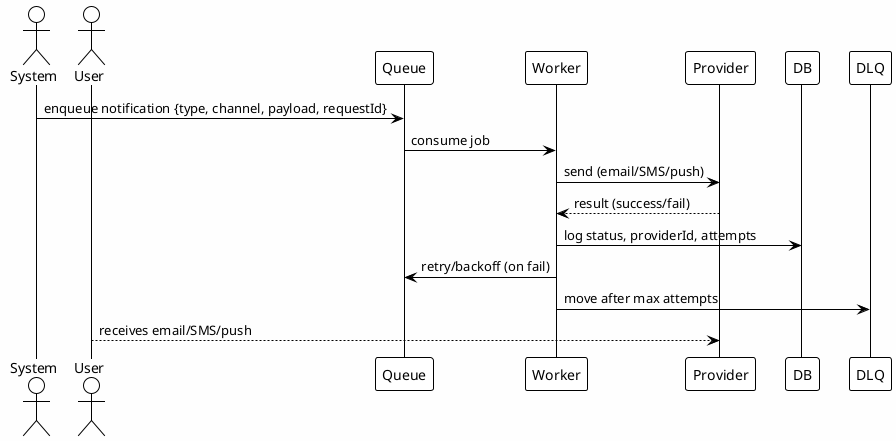

# 07_NOTIFICATION_MODULE - Hướng Dẫn Kiểm Thử Chi Tiết

**Kiểm Thử Module Thông Báo (Email / SMS / Push)**

**Phạm Vi:** UC8.1-UC8.18  
**Phiên Bản:** 1.0  
**Cập Nhật:** 7/12/2025

---

## 📋 MỤC LỤC

1. [Tổng Quan Module](#1-tổng-quan-module)
2. [Phân Tích Yêu Cầu](#2-phân-tích-yêu-cầu)
3. [Chiến Lược Kiểm Thử](#3-chiến-lược-kiểm-thử)
4. [Sơ Đồ Kiến Trúc](#4-sơ-đồ-kiến-trúc)
5. [Test Cases Chi Tiết](#5-test-cases-chi-tiết)
6. [Ví Dụ Mã](#6-ví-dụ-mã)
7. [Hướng Dẫn Thực Thi](#7-hướng-dẫn-thực-thi)

---

## 1. TỔNG QUAN MODULE

Module gửi thông báo cho người dùng qua nhiều kênh:

- Email: xác nhận đơn hàng, đặt lại mật khẩu, cập nhật trạng thái
- SMS: OTP, cảnh báo đơn hàng
- Push: cập nhật đơn, khuyến mãi
- Queue/batch gửi, retry, idempotency
- Opt-in/Opt-out theo user/channel

Công nghệ: Express, message queue (BullMQ/Redis hoặc tương đương), mail/SMS provider, Jest.

---

## 2. PHÂN TÍCH YÊU CẦU

### Functional

| ID  | Chức năng         | Ghi chú                                             |
| --- | ----------------- | --------------------------------------------------- |
| N1  | Gửi email sự kiện | order_created, order_status_changed, reset_password |
| N2  | Gửi SMS OTP       | mã 6 số, hết hạn 5 phút                             |
| N3  | Gửi push          | title/body + deep link                              |
| N4  | Retry & DLQ       | retry N lần, đẩy DLQ khi thất bại                   |
| N5  | Idempotency       | requestId để tránh gửi trùng                        |
| N6  | Template          | render HTML/text, i18n                              |
| N7  | Opt-out           | tôn trọng notification preferences                  |
| N8  | Logging/Audit     | lưu lịch sử gửi, trạng thái, providerId             |

### Non-Functional

| ID  | Yêu cầu    | Mục tiêu                                |
| --- | ---------- | --------------------------------------- |
| NF1 | Độ tin cậy | ≥99% gửi thành công (test env mô phỏng) |
| NF2 | Hiệu suất  | Queue latency < 1s, email < 3s          |
| NF3 | Bảo mật    | OTP random, không log plaintext OTP     |
| NF4 | Khả hồi    | Retry với backoff, DLQ xử lý được       |

Entry: provider key config, queue chạy, template có sẵn.  
Exit: 18 test cases pass, coverage ≥80%, không gửi trùng, retry đúng.

---

## 3. CHIẾN LƯỢC KIỂM THỬ

```
Unit (55%): template rendering, otp generation, idempotency keys
Integration (40%): queue + provider mock, retry/backoff, preferences, logging
E2E (5%): end-to-end order event -> email/push delivered (mock transport)
```

Kỹ thuật: State (pending→sent→failed→retry→DLQ), Boundary (OTP length/time), Idempotency, Security (PII masking), Performance (latency).

---

## 4. SƠ ĐỒ KIẾN TRÚC



---

## 5. TEST CASES CHI TIẾT (UC8.1-UC8.18)

### Email

- **UC8.1** Order created email: render template with orderId, total; status=sent
- **UC8.2** Order status change email: includes new status, timestamp
- **UC8.3** Password reset email: includes token link, expires
- **UC8.4** I18n template: locale=vi/en, correct language chosen
- **UC8.5** Opt-out respected: marketing disabled → no send

### SMS / OTP

- **UC8.6** Generate OTP 6 digits, random, not reused
- **UC8.7** OTP expires after 5 minutes → expired returns 400/401
- **UC8.8** Rate limit OTP: max X per hour
- **UC8.9** Do not log OTP plaintext (check logs/mocks)

### Push

- **UC8.10** Send push with deep link
- **UC8.11** Invalid device token → mark failed, retry or drop per policy

### Queue / Retry / DLQ

- **UC8.12** Retry on provider 5xx with backoff (e.g., 3 attempts)
- **UC8.13** Move to DLQ after max attempts; DLQ item contains error cause
- **UC8.14** Idempotency: same requestId → single send/log
- **UC8.15** Batch send (optional): bulk jobs processed, counts correct

### Logging / Audit

- **UC8.16** Log providerId, attempts, status, timestamp
- **UC8.17** Metrics: success rate, avg latency computed

### Security / Privacy

- **UC8.18** PII masking in logs (email partially masked, phone partially masked)

---

## 6. VÍ DỤ MÃ

### 6.1 Worker (rút gọn)

```javascript
// backend/controllers/notificationController.js (hoặc worker file)
async function processJob(job) {
  const { channel, payload, requestId } = job.data;

  // Idempotency check
  const existed = await prisma.notificationLog.findUnique({
    where: { requestId },
  });
  if (existed) return { status: "skipped" };

  let result;
  try {
    if (channel === "email") result = await emailProvider.send(payload);
    if (channel === "sms") result = await smsProvider.send(payload);
    if (channel === "push") result = await pushProvider.send(payload);

    await prisma.notificationLog.create({
      data: {
        requestId,
        channel,
        status: "sent",
        providerId: result?.id,
        attempts: job.attemptsMade + 1,
      },
    });
    return { status: "sent" };
  } catch (err) {
    // Let queue handle retry; log error message only (no PII)
    throw err;
  }
}
```

### 6.2 Jest với provider mock

```javascript
// backend/tests/integration/notification.test.js

jest.mock("../../lib/emailProvider", () => ({
  send: jest.fn().mockResolvedValue({ id: "mail-1" }),
}));
jest.mock("../../lib/smsProvider", () => ({
  send: jest.fn().mockResolvedValue({ id: "sms-1" }),
}));

describe("Notifications", () => {
  test("UC8.1 order created email", async () => {
    const res = await request(app)
      .post("/api/notifications/order-created")
      .set("Authorization", `Bearer ${adminToken}`)
      .send({ orderId: "ord-1", userId: "u1" });
    expect(res.status).toBe(200);
    expect(emailProvider.send).toHaveBeenCalled();
  });

  test("UC8.14 idempotency by requestId", async () => {
    await request(app)
      .post("/api/notifications")
      .send({ requestId: "req-1", channel: "email", payload: {} });
    await request(app)
      .post("/api/notifications")
      .send({ requestId: "req-1", channel: "email", payload: {} });
    const logs = await prisma.notificationLog.findMany({
      where: { requestId: "req-1" },
    });
    expect(logs.length).toBe(1);
  });
});
```

### 6.3 OTP Validation Example

```javascript
// backend/services/otpService.js
function verifyOtp(userId, otp) {
  const record = cache.get(`otp:${userId}`);
  if (!record) throw new Error("otp_expired");
  if (record.value !== otp) throw new Error("otp_invalid");
  if (Date.now() > record.expireAt) throw new Error("otp_expired");
  cache.delete(`otp:${userId}`);
}
```

---

## 7. HƯỚNG DẪN THỰC THI

```bash
# Chạy notification tests
npm test -- notification.test.js

# OTP specific
npm test -- notification.test.js -t "OTP"

# Với coverage
npm test -- notification.test.js --coverage
```

### Troubleshooting

| Vấn đề                       | Giải pháp                                |
| ---------------------------- | ---------------------------------------- |
| Gửi trùng                    | Bật idempotency (requestId) + unique log |
| OTP hết hạn không xoá        | Dùng TTL cache/Redis, xoá sau verify     |
| Retry không chạy             | Kiểm tra queue config attempts/backoff   |
| PII lộ trong log             | Mask email/phone trước khi log           |
| Provider mock không được gọi | Kiểm tra jest.mock đường dẫn chính xác   |

---

**Phiên Bản:** 1.0  
**Cập Nhật:** 7/12/2025  
**Trạng Thái:** ✅ Ready for Testing
